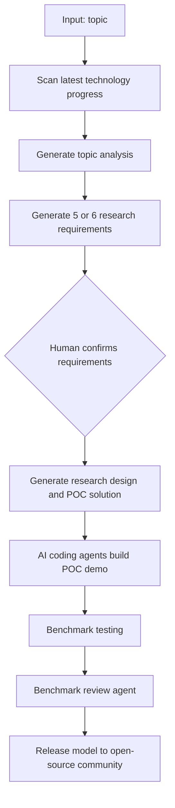
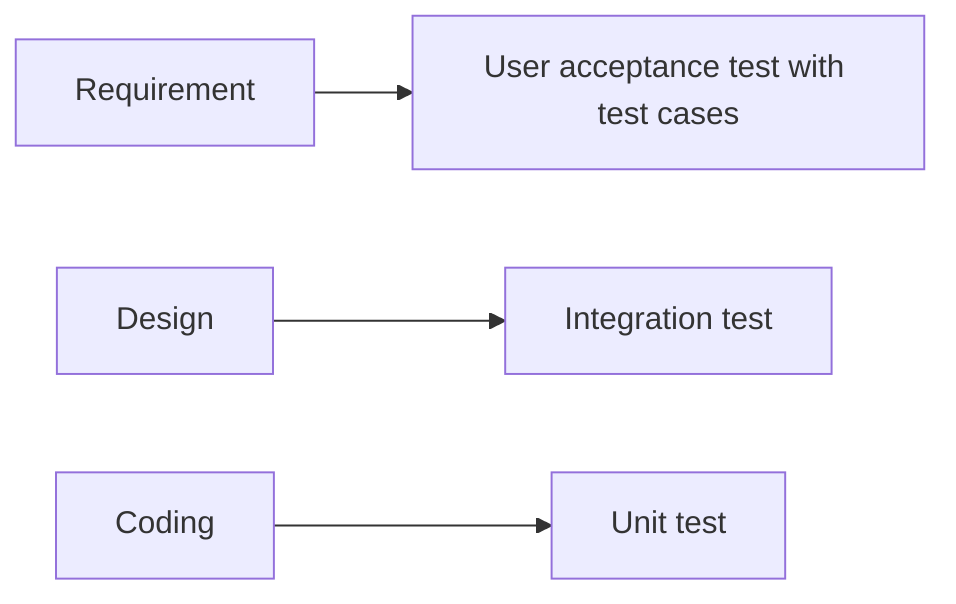
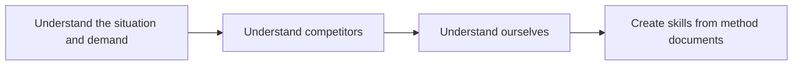

# 5.12 Project Overview

## Project Concept

AI4Research is a multi-agent system project.

- Input: topic.
- Agent goal: scan the latest technology progress under that topic and generate analysis.
- Output: research requirements for the topic.

## Process

- Research should keep a human in the loop.
- Agents generate 5 or 6 requirements in SysML v2, but the human makes the final decision and confirms the requirements.
- Research design and solution POC demo are generated after the decision is made.
- Agents use AI coding capabilities to generate the POC demo.
- Agents perform benchmark testing on benchmark demos.
- A system model can act as a harness for the multi-agent system and define constraints and rules for agents.
- The system model can define the logic and world model for agents, and can also participate in verification because output is unstable.
- A review agent should inspect benchmark results and decide whether the demo works.

## V-Model

The V-model waterfall model will be used in the pipeline:

- Requirement -> User acceptance test with test cases ready as a manifestation of the required specs.
- Design -> Integration test.
- Coding -> Unit test.

## Policy And Principle

- For any blocks involved, borrow open-source models when available.
- If an API block function can integrate into the project, integrate it, including commercial software when useful.
- AI rules:
  - Use AI to manage AI.
  - Use AI to develop AI.
  - Use AI to optimize AI.
- Fast iteration is needed.
- Spending time on the design and making it solid is necessary.
- The system should allow a human to jump in at any time.

## Multi-Agent System Requirements

- Create a skill for things the system does.

## Concerns

- Both multi-agent frameworks, OpenClaw and Hermes, are complex.
- The system may burn many tokens.
- We can subscribe for free.

## Methodology

- Skills are important for transferring human knowledge to agents.
- Model-driven skill engineering.
- Harness engineering to make sure agents function normally.

## Important Topics

- Know how to use skills to enable AI agents, and how to verify whether a skill is good, bad, or reusable.
- Multi-agent framework:
  - How to build it.
  - Pros and cons.
  - Agent orchestration.
  - Harness engineering.
  - Agent routing.
  - Context engineering.
- Models:
  - SysML v2 as constraints for the multi-agent system.
  - World model: define the basic laws and use them as ground truth to harness AI models.

## Example

Technical planning:

- Input: documents talking about methods.
- Output: create skills.
- Example request: tell chat to turn the SWOT analysis into a skill package.

## Assignment For This Week

- Understand and research the subtopic of the slide.
