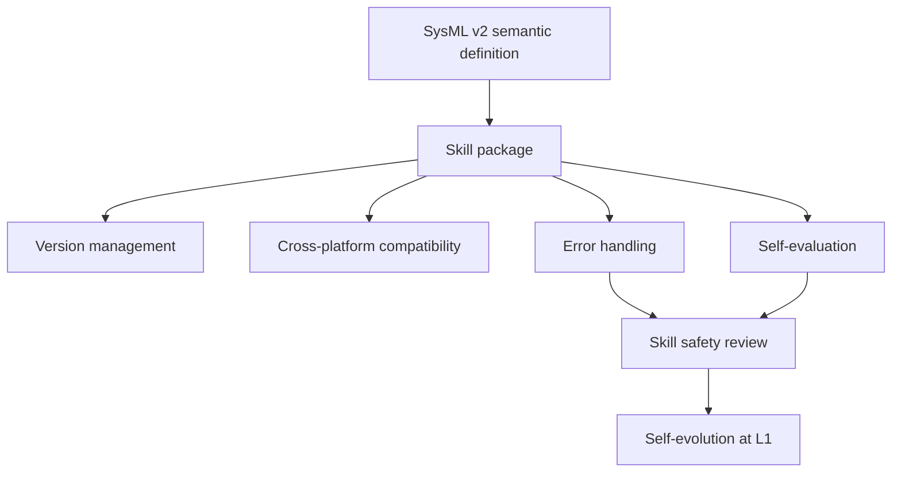

# 5.13 Skills

## Suraj's Presentation

- How to create a skill: skill creator.
- Skill input: the SysML v2 model will be part of the skill.

## Stellven's Questions From 5/10

### Skill Development

- SysML v2 provides a semantic definition of skills.
- We want to see more specific and deeper analysis.

### Skill Safety Guarantee

- Talking about skill design is on the right path, but error handling is needed as evaluation.
- Error handling and self-evaluation are different concepts.
- Sometimes skills become insufficient because the environment changes, not because an error occurred.
- Self-evolution should be in the L1 level.

### Key Parts Of Skill Engineering

- Version management should be part of skill engineering.
- A skill should be compatible with various platforms, which is also part of general skill engineering.

### Good Practice When Skills Are Developed

- Good practice means a way to make a skill package good.
- More examples are expected:
  - What tools are present.
  - Who has good ideas on this.
  - Which companies transferred their domain knowledge to a skill.

## Skill Engineering Loop

## Miscellaneous

- Future presentation format: topic, name, date.
- Define the issue in more depth and find a more valuable angle for each broad issue.
- Show how the result is obtained.
