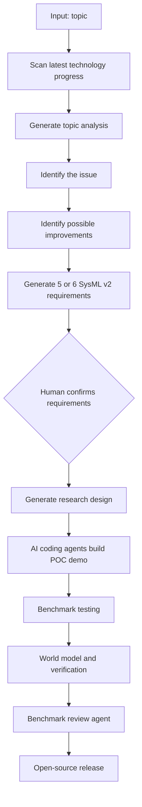
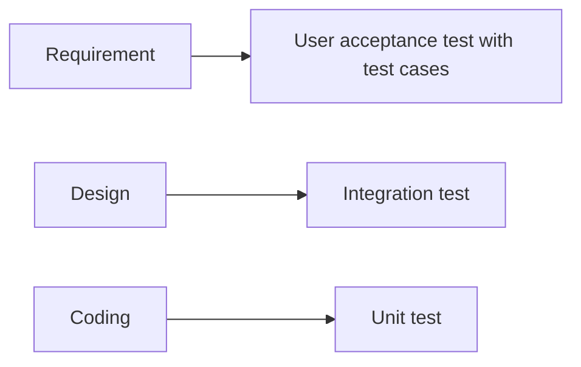
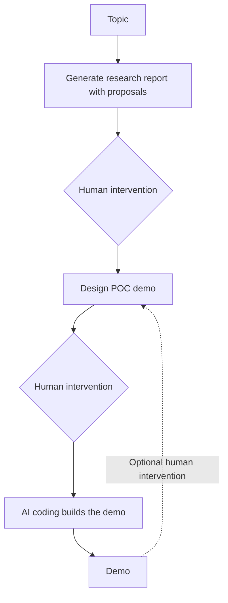

# 5.19 AI4Research Flow

## Flow For Solving An Existing Problem

- Agent scans the latest progress of technology under the topic, generates analysis, finds the issue, and identifies how to improve on it.
- Agents generate 5 or 6 requirements in SysML v2 that address the issue, but the human makes the final decision and confirms the requirements.
- After the decision is made, AI generates the research design.
- Agents use AI coding capabilities to generate a POC demo.
- Agents perform benchmark testing on benchmark demos.
- The system should define the logic and world model for the agent.
- The model can also be part of verification because output is unstable.
- A review agent should inspect benchmark results and determine whether the demo works.
- In the end, the model will be released to the open-source community.

## V-Model

The V-model waterfall model will be used in the pipeline:

- Requirement -> User acceptance test with test cases ready as a manifestation of the required specs.
- Design -> Integration test.
- Coding -> Unit test.

## Notes

- Look at open-source AI4Research projects.
- Use Codex as the agent environment.
- Use Codex to generate code.
- Functional requirement input is a research report document.
- Use agents and skills to output a PPT containing words, diagrams, and charts.

## AI4Research Function Workflow

Example topic: what are the skill life-cycle management practices of top companies?

## Target Users

- Ourselves.
- Team: expected.
- Enterprises.

## Skill Governance

How do we govern skills?

- Formalization: use equations and constraints mathematically to prove a skill is correct.
- Testing: write test cases and use practical ways to prove a skill.

Preferred method: testing.

## Example Topic

Assume the topic is worth researching:

- How do top companies govern AI?
