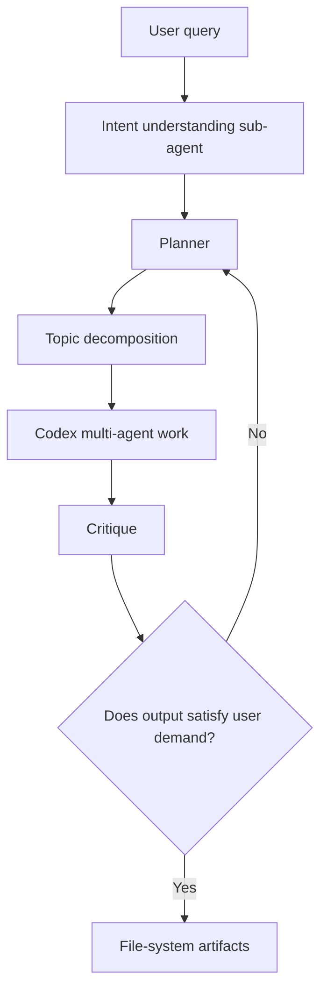

# 5.21 Meeting Notes

## Design

- Skill governance and pipeline.
- Codex as the agent environment.
- For this particular project, the design should fit the project instead of staying generic.
- Make everything file-system based.
- Define metadata ourselves.

## Codex Agent Environment

- Query: a sub-agent understands the intention of the user query.
- Different users may require different answers.
- It would be hard to pre-determine the domain, so a planner is needed.
- The planner understands intention and decomposes the topic into parts.
- A critique should assess whether the output satisfies the user's demand.
- In this project, Codex will also be used as a multi-agent environment.

## Metadata

Metadata is needed not only for skills, but also for the fundamental units and terms of data.

Examples:

- Name and description.
- Intention.
- User profile, such as `soul.md`, to define a user's intention.

## Assets And Evidence

- Asset.
- Evidence:
  - Citations.
  - Chain-of-thought summaries, which can also act like a harness.

## Evaluation Layer

- World models.
- SysML v2:
  - Good semantic harness.
  - Very heavy to use.
- Semantic tools are needed to govern skills.

## Meta Skills

- Useful for self-evolution.
- Should focus more on auditing.

## Feedback

- Good start, but the project needs a whole picture that includes Codex.
- Use Codex as the environment, but explain how to build the project with Codex.
- You described a whole picture for the full project.
- Specify the things inside each layer, such as the data layer and evaluation layer.
- Try using Codex to generate code based on the design.
