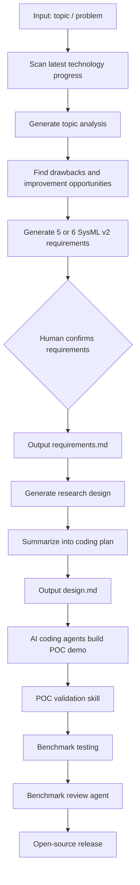
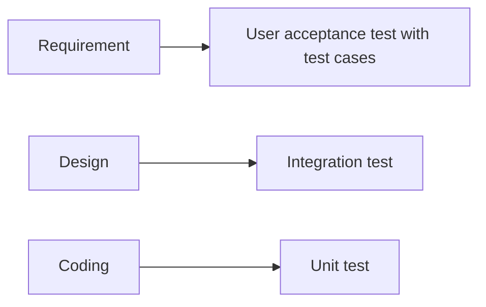

# AI4Research Workflow

## Flow For Solving An Existing Problem

## Workflow Notes

- Input: topic or problem.
- A multi-agent system scans the latest progress of technology under that topic and generates analysis to find how the project can improve on it.
- Required agent abilities:
  - Search online or from a database.
  - Form in-depth analysis on the drawbacks found.
- Agents generate 5 or 6 requirements in SysML v2 that address the issue.
- The framework should allow human-in-the-loop review at this point.
- Git version control is needed.
- The requirement step outputs `requirement.md`.
- After the decision is made, AI generates the research design.
- The analysis should be summarized into a coding plan that shortens context while preserving important points.
- The design step outputs `design.md`.
- A persistent memory layer may be needed.
- Agents use AI coding capabilities to generate the POC demo.
- A POC validation skill is needed.
- Agents perform benchmark testing on benchmark demos.
- The framework should allow AI agents to spin up Docker and test the POC.
- SysML v2 should define the logic and world model for the agent.
- The SysML model can also be part of verification because LLM output is unstable.
- A review agent should inspect benchmark results and determine whether the demo works.
- In the end, the model will be released to the open-source community.

## V-Model

The V-model waterfall model will be used in the pipeline:

- Requirement -> User acceptance test with test cases ready as a manifestation of the required specs.
- Design -> Integration test.
- Coding -> Unit test.

## Policy And Principle

- For any blocks involved, borrow open-source models when available.
- The framework should adapt to MCP.
- If an API block function can integrate into the project, integrate it, including commercial software when useful.
- AI rules:
  - Use AI to manage AI.
  - Use AI to develop AI.
  - Use AI to optimize AI.
- Fast iteration is needed.
- Spending time on the design and making it solid is necessary.
- The system should allow a human to jump in at any time.

## Multi-Agent System Requirements

- Create a skill for things the system does.
- Have the ability to create skills.

## Concerns

- Both multi-agent frameworks, OpenClaw and Hermes, are complex.
- The system may burn many tokens.
- We should be able to see the agent thinking process.
