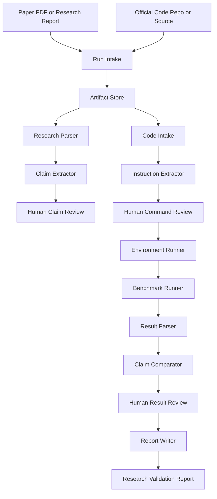

# Phase 0 Technical Architecture

## Summary

Phase 0 is implemented as a local, artifact-first research validation pipeline. It accepts a research paper PDF or research report plus official code, runs the official install and benchmark instructions, compares observed results against the paper's claims, and writes a human-readable validation package.

The architecture should be pipeline-first, not agent-first:

```text
CLI command
  -> orchestrator
  -> typed pipeline steps
  -> visible artifacts
  -> human gates
  -> final validation report
```

AI can support extraction and summarization, but artifacts are the system interface.

## Design Principles

- Make the workflow inspectable from files.
- Keep every step resumable.
- Run the official code exactly as instructed before applying fixes.
- Separate paper claims from execution evidence.
- Save raw logs before summarizing them.
- Preserve failures as useful outputs.
- Require human review for extracted claims, commands, parsed results, and final conclusions.
- Keep Phase 0 narrow: validate official research claims before creating new POCs.

## High-Level Architecture



## Proposed Tech Stack

| Layer | Technology | Purpose |
|---|---|---|
| Main language | Python 3.12 | Pipeline implementation |
| CLI | Typer | Commands such as `phase0 create`, `phase0 run`, `phase0 report` |
| Data contracts | Pydantic | Validate JSON artifacts and step inputs/outputs |
| Artifact storage | Local filesystem | Store Markdown, JSON, JSONL, logs, and copied inputs |
| Event log | JSONL | Append-only run trace in `integration/pipeline_run_log.jsonl` |
| PDF parsing | PyMuPDF first, pdfplumber fallback | Extract text from research PDFs |
| Markdown parsing | Python Markdown/plain text parsing | Read structured research reports |
| Repository intake | Git CLI | Clone official code and capture commit metadata |
| Command execution | Python `subprocess` | Run official install and benchmark commands |
| Environment isolation | Python venv for MVP, Docker later | Keep installs separate from the host where possible |
| Dependency management | Repo-provided commands first, `uv` or `pip` when instructed | Follow official setup instructions |
| Testing | pytest | Unit and integration tests for pipeline components |
| AI assistance | Codex/OpenAI behind a runtime interface | Narrow extraction and summarization tasks |
| Reports | Markdown | Human-readable review and validation documents |

## Package Structure

```text
ai4research_b/
  cli.py
  orchestrator.py
  artifacts.py
  events.py
  models.py
  runtime.py
  phase0/
    __init__.py
    intake.py
    research_parser.py
    claim_extractor.py
    code_intake.py
    instruction_extractor.py
    command_review.py
    environment_runner.py
    benchmark_runner.py
    result_parser.py
    claim_comparator.py
    report_writer.py
    extended_benchmarks.py
tests/
  phase0/
    test_intake.py
    test_claim_models.py
    test_command_plan.py
    test_result_comparator.py
    fixtures/
```

## Component Responsibilities

### CLI

Provides user-facing commands.

Example commands:

```text
ai4research-b phase0 create --paper paper.pdf --code https://github.com/example/project
ai4research-b phase0 extract-claims --run runs/<run_id>
ai4research-b phase0 inspect-code --run runs/<run_id>
ai4research-b phase0 run-install --run runs/<run_id>
ai4research-b phase0 run-benchmark --run runs/<run_id>
ai4research-b phase0 compare --run runs/<run_id>
ai4research-b phase0 report --run runs/<run_id>
```

The CLI should expose each step separately so a human can pause, inspect files, revise artifacts, and resume.

### Orchestrator

Coordinates step order and resumability.

Responsibilities:

- Create run IDs.
- Resolve artifact paths.
- Validate that required inputs exist before each step.
- Append events to the run log.
- Stop at human gates.
- Resume from the last successful step.
- Preserve failure artifacts.

The orchestrator should call step functions through explicit inputs and outputs, not through hidden memory.

### Artifact Store

Owns all file paths under `runs/<run_id>/`.

Responsibilities:

- Create directories.
- Read and write JSON, Markdown, JSONL, and logs.
- Validate artifact existence.
- Prevent accidental overwrite unless the step is explicitly rerun.
- Keep raw evidence separate from summaries.

### Research Parser

Accepts either `paper.pdf` or `research_report.md`.

Responsibilities:

- Extract readable text.
- Preserve source locations when possible.
- Write `paper_parse.md`.
- Write `paper_parse.json`.
- Mark parse quality and missing sections.

### Claim Extractor

Extracts validation-relevant claims.

Responsibilities:

- Identify the main technical claim.
- Identify the solved challenge.
- Identify benchmark names, datasets, metrics, and reported values.
- Separate concrete benchmark claims from vague qualitative claims.
- Write `claims.json`, `benchmark_claims.json`, and `claims.md`.

This component may use AI assistance, but the output must be human-reviewable.

### Code Intake

Records and obtains the official code.

Responsibilities:

- Clone official repositories or copy local source.
- Record source URL, local path, commit hash, branch, and timestamp.
- Identify README, environment files, scripts, and benchmark directories.
- Write `code_manifest.json` and `repo_snapshot.md`.

### Instruction Extractor

Finds the official install and benchmark instructions.

Responsibilities:

- Read README, docs, paper appendix, scripts, and config files.
- Extract install commands.
- Extract benchmark commands.
- Record whether commands require network, GPU, datasets, weights, API keys, or external services.
- Write `official_instructions.md` and `command_plan.json`.

The MVP should allow manual editing of `command_plan.json` before execution.

### Environment Runner

Runs official installation commands.

Responsibilities:

- Create or select an isolated working environment.
- Execute official install commands exactly as recorded.
- Save stdout and stderr.
- Capture Python version, OS, package list, and relevant hardware info.
- Write `environment.json`.

The runner should not silently fix failed installs. Any fix must be recorded as a separate deviation from official instructions.

### Benchmark Runner

Runs official benchmark commands.

Responsibilities:

- Execute benchmark commands exactly as recorded.
- Apply configured timeout.
- Save raw stdout and stderr.
- Copy generated result files into `raw_benchmark_outputs/`.
- Record exit code, start time, end time, and runtime.

### Result Parser

Extracts observed metrics.

Responsibilities:

- Parse known result files when available.
- Parse stdout/stderr as a fallback.
- Record metric name, value, unit, dataset, split, and run configuration.
- Write `benchmark_results.json` and `benchmark_results.md`.

If the output format is unclear, the result should be marked `not_testable` rather than guessed.

### Claim Comparator

Compares observed results to the paper's reported benchmark claims.

Responsibilities:

- Match observed metric to benchmark claim.
- Compare reported and observed values.
- Apply explicit tolerance when provided.
- Otherwise use exact match for deterministic metrics or a human-reviewed interpretation for noisy metrics.
- Write `claim_comparison.json` and `claim_comparison.md`.

### Report Writer

Creates the final human-readable report.

Responsibilities:

- Summarize the paper, code source, benchmark, result, and conclusion.
- Link to all relevant artifacts.
- State final status.
- List limitations and failures.
- Separate official reproduction from optional extended benchmark results.

## Runtime Flow

The default full run is:

```text
create run
parse research input
extract claims
pause for claim review
intake code
extract instructions
pause for command review
run install
run benchmark
parse results
compare claims
pause for result review
write final report
pause for final review
```

Each step should be independently runnable. This makes the workflow debuggable and avoids forcing users to restart from the beginning after a failure.

## Artifact Contracts

Use Pydantic models for structured artifacts:

```text
InputManifest
Claim
BenchmarkClaim
CodeManifest
CommandPlan
EnvironmentReport
BenchmarkRunPlan
BenchmarkResult
ClaimComparison
ValidationReportMetadata
RunEvent
```

Every JSON artifact should include:

- `schema_version`
- `run_id`
- `created_at`
- `created_by`
- step-specific fields

## Execution Safety

Phase 0 executes research code, so safety must be visible.

MVP safety rules:

- Only run official code for papers that include code.
- Save the command plan before execution.
- Require human review before install and benchmark execution.
- Run commands from the official repo working directory.
- Capture logs and exit codes.
- Do not hide failed commands.
- Do not patch official code unless a human approves a recorded deviation.
- Mark commands that require network, GPU, dataset downloads, model weights, API keys, Docker, or external services.

Future safety improvements:

- Docker-based isolation.
- Resource limits.
- Network allowlist.
- File write boundary checks.
- Dataset and model weight provenance checks.
- Malware/static analysis checks for untrusted repositories.

## Observability

Every step appends an event to:

```text
runs/<run_id>/integration/pipeline_run_log.jsonl
```

Event shape:

```json
{
  "schema_version": "0.1",
  "run_id": "2026-05-28-example",
  "step": "benchmark_execution",
  "status": "completed",
  "started_at": "2026-05-28T14:00:00Z",
  "ended_at": "2026-05-28T14:07:00Z",
  "artifacts_written": [
    "phase_0/benchmark_stdout.txt",
    "phase_0/benchmark_results.json"
  ],
  "message": "Benchmark completed and produced parseable output."
}
```

Thought playback summaries should be written to:

```text
runs/<run_id>/playback/thought_playback.md
runs/<run_id>/playback/decision_trace.jsonl
```

These summaries should describe decisions, assumptions, uncertainty, and review needs without relying on raw hidden reasoning.

## Testing Strategy

### Unit Tests

- Artifact path generation.
- Pydantic schema validation.
- Command plan validation.
- Benchmark result parsing.
- Claim comparison rules.
- Status label selection.

### Integration Tests

- Run Phase 0 on a tiny fixture repository with a fake benchmark script.
- Verify install logs are captured.
- Verify benchmark output is parsed.
- Verify claim comparison is correct.
- Verify final report includes required sections.

### Golden Fixture

Create a small local fake paper/report and fake official code repository:

```text
tests/fixtures/phase0_fake_paper/
  research_report.md
  official_code/
    README.md
    requirements.txt
    benchmark.py
    expected_results.json
```

This fixture should run fast and prove the pipeline works before using real research code.

## Implementation Milestones

### Milestone 1: Documented Manual Workflow

- Create the Phase 0 design and architecture docs.
- Define artifact templates.
- Manually validate one simple paper with code.

### Milestone 2: Run Folder And Schemas

- Implement run creation.
- Implement artifact store.
- Implement Pydantic models.
- Add tests for schemas and artifact paths.

### Milestone 3: Parsing And Extraction

- Parse PDF or Markdown report.
- Extract claims and benchmark claims.
- Add human review artifacts.

### Milestone 4: Code Intake And Command Planning

- Clone/copy official code.
- Extract README instructions.
- Write editable command plan.

### Milestone 5: Execution And Comparison

- Run install and benchmark commands.
- Capture logs and result files.
- Parse benchmark results.
- Compare results to claims.

### Milestone 6: Final Report

- Generate final validation report.
- Add status labels.
- Add failure mode reporting.

### Milestone 7: Optional Extended Benchmarks

- Add benchmark design artifact.
- Run additional benchmarks separately from official reproduction.
- Report extended results without mixing them into reproduction status.

## Why This Is Not An Agent Architecture

Phase 0 should not start with agents such as "Claim Agent" or "Benchmark Agent." That makes the workflow hard to inspect and easy to derail.

Instead, Phase 0 starts with stable artifacts and deterministic step boundaries:

```text
extract_claims(paper_parse) -> claims.json
inspect_code(code_source) -> code_manifest.json
run_benchmark(command_plan) -> benchmark logs
compare_results(claims, results) -> claim_comparison.md
```

After these boundaries are clear, any step can later be powered by Codex, another model, a script, or a human. The pipeline stays understandable because files define the contract.
