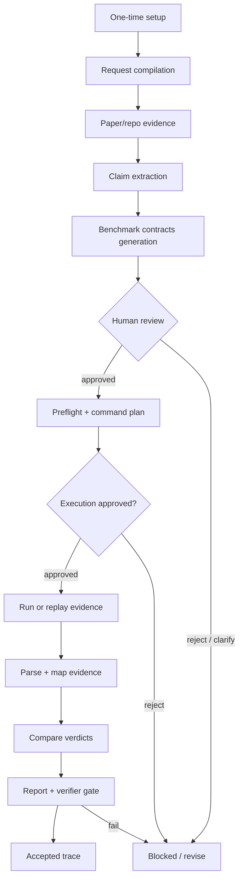

# Paper-to-Claim Verification Pipeline on Solar

## 1. What is Paper-to-Claim?

It's a pipeline that takes in a paper, and generates a report that verifies the claims mentioned in the paper.

## 2. What Are the Steps?

## 3. How Are We Going to Make the Steps Happen?

The MVP should show the domain workflow, not every Harness runtime hop. Solar Harness internally handles capsule resolution, logical routing, actor leasing, inbox/result files, guard/resource attachment, accepted artifact records, and sprint traces.

| Step | Workflow step | Module/tool used | New tools | Main outputs | Gate / error handling |
| --- | --- | --- | --- | --- | --- |
| 0 | One-time setup | `capability_capsules.py`, `logical-operators.json`, existing physical operators | `cap.phase0-claim-verification`, `ResearchClaimVerifier`, new schemas, comparator, golden fixture | capsule, registry entry, logical binding, schema module, tests | Missing setup blocks the pipeline before runtime dispatch. |
| 1 | Intake paper verification request | `scripts/solar-codex-intake.sh`, `core/harness/submitCoreToHarness()` | Pipeline request payload: paper, repo, objective, target claims, budget | `verification_request.json`, `requirement_ir.json` | Missing paper/repo/budget returns to user before claim work starts. |
| 2 | Ingest paper and repo evidence | Solar knowledge/QMD/MinerU path, `ResearchScout`, `ResearchSynthesizer`, `EvidenceItem`, `CitationSpan` | Source map over paper sections, tables, appendix, repo files, configs, prior artifacts | `source_map.json`, `paper_evidence.json`, `repo_evidence.json` | Missing official source marks affected claims `blocked` or `not_testable`; no guessing. |
| 3 | Extract benchmark claims | Research `Claim`, `ClaimEvidenceLink`, `EvidenceItem` | `BenchmarkClaim`: metric, dataset, split, config, expected value, tolerance | `paper_claims.json`, `claim_evidence_links.json` | Ambiguous or non-benchmarkable claims go to human review. |
| 4 | Write and approve benchmark contracts | `BenchmarkRunRequest`, `BenchmarkRunPlan`, `BenchmarkAdapter.plan()`, `VerifierLite` | `BenchmarkContract`, `HumanReviewDecision` | `benchmark_contracts.json`, `contract_review.json` | Rejected/unclear contracts return to claim extraction; no execution before approval. |
| 5 | Preflight and approve execution | `BenchmarkDoctor`, `BenchmarkAdapter.doctor()`, `BenchmarkRunPlan`, `VerificationGate.check_destructive_action()` | `ExecutionReadinessStatus`, provider/cost policy, command approval | `execution_readiness.json`, `benchmark_doctor.json`, `approved_command_plan.json`, `command_approval.json` | Dependency/model/API failures affect readiness only; readiness cannot upgrade claim verdict. |
| 6 | Run benchmark or replay fixture | `BenchmarkRunner`, `BenchmarkAdapter.run()`, `BenchmarkRunResult`, existing physical operators | AI4Research-B adapter/replay runner; optional real benchmark adapter | `benchmark_run_result.json`, stdout/stderr, raw artifacts | Preserve failed logs. Provider/API failures are readiness blockers; negative results stay `not_reproduced`. |
| 7 | Parse metrics and map evidence | `BenchmarkAdapter.parse_result()`, `BenchmarkRunResult.artifacts`, `EvidenceItem`, `ClaimEvidenceLink` | `ObservedMetric`, `Phase0RunManifest`, `Phase0EvidenceMap` | `parsed_observed_results.json`, `run_manifest.json`, `evidence_map.json` | Low-confidence metrics or broken evidence links block comparison. |
| 8 | Compare claim vs observation | Existing evidence alignment/evaluator patterns | `ClaimComparison`, `Phase0VerdictStatus`, comparator policy | `claim_comparison.json` | No verdict without evidence ids. Smoke/reconstructed evidence cannot upgrade aggregate claims. |
| 9 | Report, verify, and accept | `ResearchSynthesizer`, `ReportAST`, `Verifier`, `VerifierLite`, `evaluate_final_closeout()`, `VerificationGate` | `Phase0VerificationSummary`, report template, golden fixture assertions | `phase0_verification_report.md`, `phase0_verification_summary.json`, `eval_json`, accepted trace | Verifier rejects unsupported paper-level status or readiness-as-reproduction errors. |

Harness-internal steps omitted from the presentation table:

- resolving and validating the already installed capability capsule;
- selecting and leasing a physical actor for `ResearchClaimVerifier`;
- writing operator inbox/result envelopes;
- attaching guard/resource capsules;
- releasing leases, scrubbing secrets, and preserving accepted artifact traces.

## MVP Boundary

For the first version, keep the claim verification workflow inside one logical operator: `ResearchClaimVerifier`. Internally it coordinates claim extraction, contract writing, metric parsing, comparison, and reporting. Benchmark execution stays delegated to `BenchmarkRunner` or a `BenchmarkAdapter`-compatible wrapper.

Do not add a new physical operator, scheduler path, or ChatGPT-specific operator identity unless the existing Solar pool cannot support the workflow.
