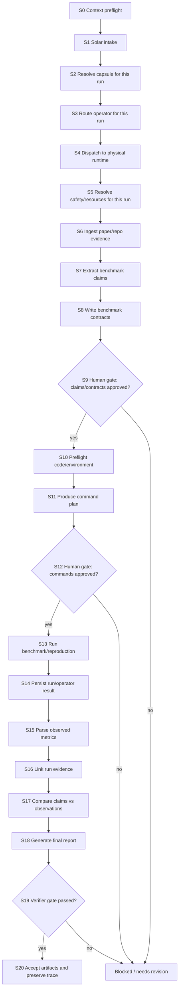

# Paper to Claim Verifier Based on Solar

## Goal

Migrate the AI4Research-B Phase 0 paper claim verification workflow into Solar with the smallest practical amount of new infrastructure.

The target design should reuse Solar's existing Harness runtime, physical operators, benchmark abstractions, verification gates, artifact handling, and knowledge context. The new work should focus on the missing domain layer: a Solar-native logical operator, a capability capsule, and claim-verification schemas/comparison logic.

The system should verify benchmark claims from a paper against evidence produced from official code or approved reproduction runs. It must preserve the Phase 0 distinction between:

- `claim_verdict_status`: what the evidence proves about the paper claim.
- `execution_readiness_status`: whether the code, adapter, environment, or command path is operationally ready.

Execution readiness must not be treated as claim reproduction evidence.

## Solar Reuse Inventory

This migration should be implemented as a thin Phase 0 domain layer on top of existing Solar infrastructure. The first version should add a new logical operator and capability capsule, while reusing Solar's existing physical operators, dispatch runtime, benchmark structures, evidence structures, and verification gates.

The detailed binding of reused Solar tools, skills, operators, capsules, functions, schemas, and artifacts is maintained in the `Workflow` table below. This section only defines the reuse categories used by that table.

- `direct`: call or import the existing Solar function/class as-is.
- `config`: add or extend Solar configuration using the existing format.
- `adapter`: wrap Phase 0 data so it matches an existing Solar interface.
- `pattern`: follow the existing Solar contract, but add a Phase 0-specific schema around it.
- `**NEW_SOLAR_SCHEMA:** <Name>`: Solar does not currently define this exact schema; we need to add it in prerequisite `P5`.

## Users / Use Cases

<!--Primary users:

- AI4Research-B researchers running Phase 0 paper verification.
- Solar operators or PM-style dispatchers who submit paper verification tasks.
- Human reviewers who approve extracted claims, benchmark contracts, commands, and final verdicts.
-->

Core use cases:

- Submit a paper, official repository, and reproduction objective to Solar.
- Extract benchmarkable claims and convert them into verification contracts.
- Reuse Solar's existing execution surfaces to run approved benchmark commands.
- Parse observed metrics and compare them to paper claims.
- Produce an evidence-backed verification report with claim-level and paper-level statuses.
- Gate the final result through Solar's existing verifier/evaluation path.

## Success Criteria

The migration is successful when:

- Solar can represent a paper claim verification task as a Solar-native capability.
- The task can be scheduled through existing Harness/operator mechanisms.
- Existing physical operators can execute or coordinate the work without adding a new runtime path.
- Benchmark execution reuses or adapts existing Solar benchmark schemas.
- Final verdicts are backed by explicit evidence artifacts.
- `claim_verdict_status` and `execution_readiness_status` remain separate.
- The previous Phase 0 completed paper can be used as a golden fixture and produces the same high-level conclusion.

Non-goals for the first version:

- Do not create a ChatGPT-specific claim verifier.
- Do not replace evidence/model-driven paths with keyword heuristics.
- Do not add a new physical operator unless existing physical operators prove insufficient.
- Do not modify Solar's operator runtime or scheduler for the initial integration.

## Inputs

Solar already provides intake, task packaging, operator dispatch, benchmark run structures, and evidence/report structures. The claim verifier should map Phase 0 inputs onto those existing surfaces.

| Input | Solar Reuse | Status |
| --- | --- | --- |
| User verification request | Harness intake / requirement pipeline | existing |
| Paper PDF or markdown | Solar knowledge / QMD / document indexing path | existing or partial |
| Official code repository | Existing code execution / benchmark workspace patterns | existing or partial |
| Extracted claims | Research `Claim` schema can inform shape; metric-specific extraction needs **NEW_SOLAR_SCHEMA: `BenchmarkClaim`** | partial + new schema |
| Evidence items | Research `EvidenceItem` / citation structures | existing |
| Benchmark plan | `BenchmarkRunPlan` | existing |
| Benchmark run result | `BenchmarkRunResult` | existing |
| Phase 0 benchmark contract | **NEW_SOLAR_SCHEMA: `BenchmarkContract`** | new |
| Observed metric input/result sidecar | `BenchmarkRunResult.artifacts` can point to source files; parsed metric object needs **NEW_SOLAR_SCHEMA: `ObservedMetric`** | new |
| Claim comparison result | **NEW_SOLAR_SCHEMA: `ClaimComparison`** | new |
| Verdict/readiness status fields | No exact Solar schema; needs **NEW_SOLAR_SCHEMA: `Phase0VerdictStatus`** and **NEW_SOLAR_SCHEMA: `ExecutionReadinessStatus`** | new |

## Outputs

The concrete output filenames are bound to workflow steps in the `Workflow` table. This table records the Solar schema or source file each output should follow. `new Phase 0 schema` means Solar has adjacent primitives, but the exact claim-verification schema must be added as part of prerequisite `P5`.

| Output | Workflow step | Solar schema/source file followed | Status |
| --- | --- | --- | --- |
| `context_injection.md` | S0 | `$HOME/.solar/bin/solar-harness context inject` output format | existing CLI output |
| `knowledge_hits.json` | S0 | Solar knowledge search output from `solar-harness wiki qmd-search` / `solar-harness mirage search` | existing CLI output |
| `verification_request.json` | S1 | Core/Harness intake shape from `core/harness/submitCoreToHarness()` or `scripts/solar-codex-intake.sh` | existing intake pattern |
| `requirement_ir.json` | S1 | Requirement compiler artifact pattern; see `harness/lib/requirement_compiler/artifacts.py` | existing artifact pattern |
| `resolved_capsule.json` | S2 | `harness/lib/capability_capsules.py` result from `resolve_capability_capsule_for_envelope()` | existing runtime shape |
| `capsule_validation.json` | S2 | `harness/lib/capability_capsules.py` validation result from `validate_capability_capsule()` | existing runtime shape |
| `operator_binding.json` | S3 | `harness/lib/logical_operator_router.py` routing output pattern | existing routing pattern |
| `selected_actor.json` | S3 | `harness/lib/logical_operator_router.py` result from `select_actor()` | existing routing pattern |
| `task_envelope.json` | S4 | `harness/lib/operator_runtime.py` required task envelope keys for `submit()` | existing runtime shape |
| `lease.json` | S4 | `harness/lib/operator_runtime.py` lease shape from `acquire_operator_lease()` | existing runtime shape |
| operator inbox task JSON | S4 | `harness/lib/operator_runtime.py` inbox envelope written by `submit()` | existing runtime shape |
| `safety_policy.json` | S5 | Capability effects/risk fields from `harness/config/capability-capsules/*.yaml` plus `harness/lib/verification_gate.py` | existing policy pattern |
| `resource_capsules.json` | S5 | Attached guard/resource capsule list from `harness/lib/capability_capsules.py` | existing runtime shape |
| `source_map.json` | S6 | `harness/lib/research/schemas.py` source/evidence model concepts | partial existing pattern |
| `paper_evidence.json` | S6 | `harness/lib/research/schemas.py::EvidenceItem` | existing schema |
| `repo_evidence.json` | S6 | `harness/lib/research/schemas.py::EvidenceItem` | existing schema |
| `paper_claims.json` | S7 | `harness/lib/research/schemas.py::Claim` plus **NEW_SOLAR_SCHEMA: `BenchmarkClaim`** | new Phase 0 schema |
| `claim_evidence_links.json` | S7 | `harness/lib/research/schemas.py::ClaimEvidenceLink` | existing schema |
| `benchmark_contracts.json` | S8 | `harness/lib/benchmark/schemas.py::BenchmarkRunRequest` / `BenchmarkRunPlan` plus **NEW_SOLAR_SCHEMA: `BenchmarkContract`** | new Phase 0 schema |
| `human_claim_review.json` | S9 | Capability gate/review artifact pattern plus **NEW_SOLAR_SCHEMA: `HumanReviewDecision`** | new Phase 0 sidecar |
| `contract_review.json` | S9 | Capability gate/review artifact pattern plus **NEW_SOLAR_SCHEMA: `HumanReviewDecision`** | new Phase 0 sidecar |
| `execution_readiness.json` | S10 | `harness/lib/benchmark/schemas.py::BenchmarkDoctor` plus **NEW_SOLAR_SCHEMA: `ExecutionReadinessStatus`** | new Phase 0 schema |
| `benchmark_doctor.json` | S10 | `harness/lib/benchmark/schemas.py::BenchmarkDoctor` | existing schema |
| `approved_command_plan.json` | S11 | `harness/lib/benchmark/schemas.py::BenchmarkRunPlan` plus **NEW_SOLAR_SCHEMA: `HumanReviewDecision`** approval sidecar | partial existing pattern |
| `benchmark_run_plan.json` | S11 | `harness/lib/benchmark/schemas.py::BenchmarkRunPlan` | existing schema |
| `command_approval.json` | S12 | Capability gate/review artifact pattern plus **NEW_SOLAR_SCHEMA: `HumanReviewDecision`** | new Phase 0 sidecar |
| `risk_review.json` | S12 | `harness/lib/verification_gate.py` decision output pattern | existing gate pattern |
| `benchmark_run_result.json` | S13/S14 | `harness/lib/benchmark/schemas.py::BenchmarkRunResult` | existing schema |
| `stdout.txt` / `stderr.txt` | S13 | Paths referenced by `harness/lib/benchmark/schemas.py::BenchmarkRunResult.stdout_path/stderr_path` | existing reference fields |
| raw run artifacts | S13 | Paths referenced by `harness/lib/benchmark/schemas.py::BenchmarkRunResult.artifacts` | existing reference fields |
| `operator_result.json` | S14 | `harness/lib/operator_runtime.py` result shape from `write_result()` | existing runtime shape |
| `run_manifest.json` | S14 | Run-artifact manifest pattern around `BenchmarkRunResult` and artifact refs; **NEW_SOLAR_SCHEMA: `Phase0RunManifest`** | new Phase 0 sidecar |
| `parsed_observed_results.json` | S15 | **NEW_SOLAR_SCHEMA: `ObservedMetric`**; references `BenchmarkRunResult.artifacts` | new Phase 0 schema |
| `run_evidence.json` | S16 | `harness/lib/research/schemas.py::EvidenceItem` | existing schema |
| `evidence_map.json` | S16 | `harness/lib/research/schemas.py::ClaimEvidenceLink` plus **NEW_SOLAR_SCHEMA: `Phase0EvidenceMap`** | partial existing pattern |
| `claim_comparison.json` | S17 | **NEW_SOLAR_SCHEMA: `ClaimComparison`**; informed by `harness/lib/research/claim_compiler.py::ClaimEvidenceAlignment` | new Phase 0 schema |
| `phase0_verification_report.md` | S18 | Report pattern from `harness/lib/research/schemas.py::ReportAST` and verifier handoff reports | partial existing pattern |
| `phase0_verification_summary.json` | S18 | **NEW_SOLAR_SCHEMA: `Phase0VerificationSummary`** derived from claim comparisons | new Phase 0 schema |
| `eval_md` | S19 | Output contract pattern from `harness/config/capability-capsules/cap.requirement-compiler-verification.yaml` | existing capsule output pattern |
| `eval_json` | S19 | Output contract pattern from `harness/config/capability-capsules/cap.requirement-compiler-verification.yaml`; consumed by evaluator/gate code | existing capsule output pattern |
| `gate_result.json` | S19 | `harness/lib/verification_gate.py` return shape from gate checks | existing gate pattern |
| `accepted_artifact_record.json` | S20 | Solar accepted-artifact/export/indexing pattern; see `harness/lib/accepted-artifact-export.py` and Solar DB accepted artifacts | existing artifact pattern |
| final operator `result.json` | S20 | `harness/lib/operator_runtime.py` result shape from `write_result()` | existing runtime shape |
| `sprint_trace.json` | S20 | TaskGraph runtime state pattern from `harness/lib/task_graph_state_io.py` / `harness/lib/task_graph_io.py` | existing runtime pattern |

## Prerequisites Before First Run

These items are setup work. They are not repeated for every paper verification run unless the capability, schemas, bindings, or implementation change.

| ID | Prerequisite | Solar files/functions involved | Done once or per change | Verification |
| --- | --- | --- | --- | --- |
| P0 | Create the Phase 0 capability capsule manifest. | `harness/config/capability-capsules/cap.phase0-claim-verification.yaml`; pattern from `cap.requirement-compiler-verification.yaml` | Once, then update when contract changes | Capsule manifest exists and declares inputs, outputs, invariants, effects, guard/resource capsules, verification hooks, and operator compatibility. |
| P1 | Register the new capability capsule. | `harness/config/capability-capsules.registry.yaml`; `load_capability_capsule_registry()` | Once, then update if capsule id/version changes | Registry entry resolves to the manifest path. |
| P2 | Validate the capsule schema and semantics. | `load_capability_capsule_manifest()`; `normalize_capability_capsule()`; `validate_capability_capsule()` | Per capsule change | Validation passes before any run uses the capsule. |
| P3 | Add the `ResearchClaimVerifier` logical operator. | `harness/config/logical-operators.json` | Once, then update if routing/capability profile changes | Logical operator entry exists with model-neutral capabilities. |
| P4 | Bind `ResearchClaimVerifier` to existing physical operators. | `harness/config/physical-operators.json`; `LogicalOperatorRouter.get_candidates()`; `LogicalOperatorRouter.select_actor()` | Once, then update if actor pool changes | Router can select an existing actor; no new physical operator required for MVP. |
| P5 | Define Phase 0 claim verification schemas. | New schema module for **NEW_SOLAR_SCHEMA: `BenchmarkClaim`**, **NEW_SOLAR_SCHEMA: `BenchmarkContract`**, **NEW_SOLAR_SCHEMA: `ObservedMetric`**, **NEW_SOLAR_SCHEMA: `ClaimComparison`**, **NEW_SOLAR_SCHEMA: `Phase0VerdictStatus`**, **NEW_SOLAR_SCHEMA: `ExecutionReadinessStatus`**, **NEW_SOLAR_SCHEMA: `HumanReviewDecision`**, **NEW_SOLAR_SCHEMA: `Phase0RunManifest`**, **NEW_SOLAR_SCHEMA: `Phase0EvidenceMap`**, **NEW_SOLAR_SCHEMA: `Phase0VerificationSummary`** | Once, then update with schema versioning | Schema validation tests pass. |
| P6 | Implement the Phase 0 comparator. | New comparator library using `EvidenceItem`, `ClaimEvidenceLink`, benchmark results, and observed metrics | Once, then update with comparison policy changes | Unit tests cover each verdict and readiness separation rule. |
| P7 | Add golden fixture tests from the completed Phase 0 paper. | Existing Phase 0 artifacts; test fixtures in AI4Research-B | Once, then update when fixture baseline intentionally changes | Golden test preserves known `not_reproduced` / `blocked` conclusions and does not treat readiness as reproduction evidence. |

The runtime workflow below assumes these prerequisites are already installed and validated. Runtime steps such as `S2 Resolve capsule for this run` still happen on every task: they are admission checks against the already registered capsule, not one-time setup.

## Workflow

The workflow uses the same step ids in the flowchart and table. Keep `S0` through `S20` synchronized when adding, removing, or renaming steps.



First-version implementation should keep most Phase 0 stages inside one logical operator/capability boundary. The table below is the single source of truth for workflow, artifacts, human gates, failure modes, tests/checks, and reused Solar tools/operators/code.

| Step | Flowchart node | Phase 0 action | Output artifacts | Solar reuse | Additional tools/assets outside Solar reuse | Human gate | Failure modes | Failure solution | Tests / checks | New Phase 0 logic |
| --- | --- | --- | --- | --- | --- | --- | --- | --- | --- | --- |
| S0 | Context preflight | Retrieve local Solar/paper context before planning. | `context_injection.md`, `knowledge_hits.json` | Tools: `solar-harness context inject`, `wiki qmd-search`, `mirage search` | AI4Research-B design docs, prior Phase 0 logs/reports, target paper metadata | None | no local hits; degraded source; stale prior run | Fall back to explicit file paths from AI4Research-B docs/logs and record context gap; do not infer missing evidence. | query log exists; sources marked fresh/stale | Paper/repo/claim-specific queries and source selection. |
| S1 | Solar intake | Submit paper verification request into Solar. | `verification_request.json`, `requirement_ir.json` or intake package | Tools/code: `core/harness/submitCoreToHarness()`, `scripts/solar-codex-intake.sh` | User request, paper path/PDF, official repo URL/path, target run budget | Scope confirmation if request is ambiguous | missing paper/repo; invalid run mode; budget unspecified | Block intake and request/record missing artifact or budget; do not create a runnable contract from incomplete scope. | required fields validation; path existence check | Phase 0 request payload for paper, repo, target claims, run mode, budget. |
| S2 | Resolve capsule for this run | Resolve and validate the already-registered Phase 0 capsule for this task envelope. | `resolved_capsule.json`, `capsule_validation.json` | Capsule: `cap.phase0-claim-verification`; code: `load_capability_capsule_registry()`, `load_capability_capsule_manifest()`, `normalize_capability_capsule()`, `validate_capability_capsule()`, `resolve_capability_capsule_for_envelope()` | Installed prerequisite artifacts: capsule manifest and registry entry from P0-P2 | None | capsule missing; schema invalid; preconditions not satisfied; operator incompatible | Stop before dispatch, fix P0-P2 capsule/registry/schema, then rerun admission; no deterministic fallback capsule. | capsule validation passes; required outputs declared; guard/resource capsules attached | Runtime admission check against the capsule created in prerequisites P0-P2. |
| S3 | Route operator for this run | Route this task to the `ResearchClaimVerifier` logical operator and existing physical actors. | `operator_binding.json`, `selected_actor.json` | Operator: `ResearchClaimVerifier`; config: `logical-operators.json`, `physical-operators.json`; code: `LogicalOperatorRouter.get_candidates()`, `select_actor()` | Installed prerequisite bindings from P3-P4; selected backend identity such as Codex/Claude/ChatGPT/local shell | None | unbound operator; no candidate actor; quota/risk denied | Fix P3-P4 binding or choose an already registered physical actor; keep MVP rule of no new physical operator unless existing pool is insufficient. | router returns candidate; no new physical operator required | Runtime selection using logical operator and bindings created in prerequisites P3-P4. |
| S4 | Dispatch to physical runtime | Submit task envelope through existing runtime. | `task_envelope.json`, `lease.json`, operator inbox task JSON | Code: `operator_runtime.submit()`, `get_operator_config()`, `get_operator_status()`, `get_operator_runtime_state()`, `acquire_operator_lease()`, `list_inbox_tasks()` | Local workspace filesystem, AI4Research-B artifact paths, selected backend runtime | None | operator unavailable; lease conflict; auth expired; quota exhausted | Requeue after lease release or route to another selected actor; if auth/quota blocked, mark blocked and preserve task envelope. | envelope has required keys; lease acquired; inbox file written | Envelope includes capsule id, artifact refs, expected outputs, human-gate requirements. |
| S5 | Resolve safety/resources for this run | Resolve guard/resource capsules and apply run-specific safety constraints. | `safety_policy.json`, `resource_capsules.json` | Capsules: `guard.secret-leak-guard`, `resource.github-readonly`, `resource.repo-workspace`; code: `VerificationGate.check_destructive_action()` | Human approval record, credential availability notes, API/network policy, local disk/budget limits | Human approval for external/network/destructive actions | unsafe command; missing resource permission; secret leakage risk | Send to human approval or reduce scope to read-only/dry-run; for external API cost, apply cost governance, stop conditions, dry-run planning, and budget policy artifacts. | destructive action denied by default; secret guard attached | Runtime policy resolution using guard/resource capsules referenced by the capability manifest. |
| S6 | Ingest paper/repo evidence | Ingest paper, report, repo, instructions, configs. | `source_map.json`, `paper_evidence.json`, `repo_evidence.json` | Tools/skills: QMD/MinerU/wiki path, `MarkdownExtractor`; operators: `ResearchScout`, `ResearchSynthesizer`; schemas: `EvidenceItem`, `CitationSpan`, `to_dict()` | Paper PDF/Markdown, official repository checkout, README/docs/config files, AI4Research-B prior reproduction artifacts | None unless source choice is ambiguous | paper parse failure; repo missing; official instructions incomplete | Use explicit paper/repo paths or prior artifacts; if official source remains missing, classify affected claims as blocked/not_testable rather than guessing. | source map complete; evidence ids have source ids and spans | Map paper sections, tables, appendix, README, scripts, configs. |
| S7 | Extract benchmark claims | Extract benchmarkable paper claims. | `paper_claims.json`, `claim_evidence_links.json` | Optional skill/code: `NaiveClaimCompiler`; operator: `ResearchClaimVerifier`; schemas: `Claim`, `ClaimEvidenceLink`, `EvidenceItem`, `CitationSpan`, `to_dict()` | Paper tables/figures/appendix, claim extraction prompts, human reviewer notes from prior Phase 0 | Human claim extraction review occurs in S9 | claim not benchmarkable; claim text ambiguous; missing paper location | Route to human review; mark non-benchmarkable/out_of_scope or not_testable; keep paper span evidence and do not invent scalar claims. | each claim has evidence ids; non-benchmarkable claims classified | **NEW_SOLAR_SCHEMA: `BenchmarkClaim`** with metric, dataset, split, config, expected value, tolerance. |
| S8 | Write benchmark contracts | Convert claims into benchmark contracts. | `benchmark_contracts.json` | Operator: `ResearchClaimVerifier`; schemas/patterns: `BenchmarkRunRequest`, `BenchmarkRunPlan` | Paper metric definitions, official README commands, dataset/split/config references, Phase 0 tolerance policy | Human contract review occurs in S9 | missing metric definition; unavailable dataset/split; unclear tolerance | Use reconstructed contracts only with deviation notes; for missing splits/configs, follow prior approaches: inferred split with source review, reconstructed ablation/transfer contracts, and cap status at partial unless equivalence is proven. | schema validation; required artifacts listed | **NEW_SOLAR_SCHEMA: `BenchmarkContract`** with metric definition, aggregation, comparison logic, approval state. |
| S9 | Human gate: claims/contracts | Approve or reject extracted claims and contracts. | `human_claim_review.json`, `contract_review.json` | Operator: `VerifierLite`; capsule invariants from `cap.phase0-claim-verification`; code: `validate_capability_capsule()` | Human reviewer, review checklist, issue tracker/notes if clarification is needed | Required: claim and contract approval | rejected claim; needs clarification; contract unsafe/incomplete | Return to S7/S8 for revision; execution remains blocked until approval artifact exists. | no execution before approval; approval state present | **NEW_SOLAR_SCHEMA: `HumanReviewDecision`** with states: approved, rejected, needs clarification. |
| S10 | Preflight code/environment | Check official code, dependencies, data, model availability. | `execution_readiness.json`, `benchmark_doctor.json` | Operator: `BenchmarkRunner`; schemas/patterns: `BenchmarkDoctor`, `BenchmarkRunRequest`, `BenchmarkAdapter.doctor()` | Official repo install scripts, package managers (`uv`/`pip`/`conda`/`npm` as applicable), datasets, checkpoints, API/provider availability | Human review if preflight uses reconstructed path | dependency failure; dataset unavailable; model checkpoint unavailable | Record readiness separately; use reconstructed adapter path where appropriate, provider availability accounting, direct OpenAI fallback for OpenAI models, and avoid substituting local models as paper evidence. | readiness status separate from verdict; doctor result persisted | **NEW_SOLAR_SCHEMA: `ExecutionReadinessStatus`** independent from claim reproduction. |
| S11 | Produce command plan | Produce approved benchmark command plan. | `approved_command_plan.json`, `benchmark_run_plan.json` | Operators: `BenchmarkRunner`, `ResearchClaimVerifier`; schema/pattern: `BenchmarkAdapter.plan()`, `BenchmarkRunPlan` | Official/reconstructed run commands, shell environment variables, budget/cost policy, working-directory conventions | Human command review occurs in S12 | missing command; unsafe env; excessive cost/runtime | Add dry-run planning, stop conditions, per-entry reporting, budget policy artifacts; for unavailable native baselines, create adapter contracts/smoke slots and mark native adapters unverified. | command plan has cwd, env, budget, expected outputs | Command plan reuses `BenchmarkRunPlan`; approval uses **NEW_SOLAR_SCHEMA: `HumanReviewDecision`**. |
| S12 | Human gate: commands | Approve command execution. | `command_approval.json`, `risk_review.json` | Capsules: resource/guard capsules; code: `VerificationGate.check_destructive_action()`, `get_operator_runtime_state()` | Human reviewer, execution budget approval, credential/API-use approval, local resource approval | Required: command execution approval | command rejected; unsafe network/shell; operator not ready | Return to S11 for safer command/dry-run; require bounded pre-approval for local model or external API runs. | destructive actions denied unless approved; operator state dispatchable | Command approval uses **NEW_SOLAR_SCHEMA: `HumanReviewDecision`**; no benchmark run before explicit approval. |
| S13 | Run benchmark/reproduction | Run approved commands through existing execution surface. | `benchmark_run_result.json`, `stdout.txt`, `stderr.txt`, raw run artifacts | Operator: `BenchmarkRunner`; existing physical operators; code/pattern: `BenchmarkAdapter.run()`, `BenchmarkRunResult`, `new_run_id()`, `write_heartbeat()` | Shell/Python runtime, official code, datasets/checkpoints, provider APIs such as OpenAI/OpenRouter/Ollama when approved, local CPU/GPU resources | None during run unless budget stop triggers | command failure; timeout; API 402; dataset/model missing; partial run | Preserve failed/resume logs; rerun fresh if resume lacks checkpoint; use direct OpenAI fallback for OpenAI models; record negative outcomes as not_reproduced and valid evidence. | stdout/stderr captured; exit code recorded; run id stable | Phase 0 run layout, logs, generated metrics, deviation capture. |
| S14 | Persist run/operator result | Persist benchmark and operator results. | `operator_result.json`, `run_manifest.json`, updated `benchmark_run_result.json` | Existing physical runtime; code: `asdict_run_result()`, `operator_runtime.write_result()`, `scrub_secrets()`, `release_operator_lease()` | Local artifact directory, log files, run manifest writer, AI4Research-B artifact mirror conventions | None | result write failure; secret in log; lease not released | Retry atomic writes; scrub logs; sync top-level and categorized artifact mirrors; preserve failed/resume logs for audit. | result JSON exists; secrets scrubbed; lease released | **NEW_SOLAR_SCHEMA: `Phase0RunManifest`** links logs/artifacts to evidence ids. |
| S15 | Parse observed metrics | Parse observed metrics from run artifacts. | `parsed_observed_results.json` | Operator: `ResearchClaimVerifier`; optional `BenchmarkRunner`; pattern: `BenchmarkAdapter.parse_result()`; schema field: `BenchmarkRunResult.artifacts` | Phase 0 metric parser, table/log parsers, benchmark-specific result files, parser confidence rules | Human review if metric parse is ambiguous | metric missing; parser confidence low; incompatible format | Require trace retention for per-round evidence; if parser confidence is low, send to human review and keep claim blocked/pending rather than guessing. | parsed metric cites source artifact; parser confidence stored | **NEW_SOLAR_SCHEMA: `ObservedMetric`** with provenance, dataset/split/config, source artifacts. |
| S16 | Link run evidence | Link metrics, logs, limitations to claim evidence graph. | `run_evidence.json`, `evidence_map.json` | Operator: `ResearchClaimVerifier`; schemas: `EvidenceItem`, `ClaimEvidenceLink`, `CitationSpan`, `to_dict()` | Raw logs, stdout/stderr excerpts, metric files, deviation notes, artifact path resolver | None | artifact evidence incomplete; broken evidence link | Run traceability auditing; require explicit source_candidate_id/finalization trace fields where candidate skill lineage is ambiguous. | every observed metric has evidence id; evidence ids resolve | **NEW_SOLAR_SCHEMA: `Phase0EvidenceMap`** linking paper claims, contracts, commands, metrics, logs, limitations. |
| S17 | Compare claims vs observations | Compare observed metrics against paper claims. | `claim_comparison.json` | Operator: `ResearchClaimVerifier`; schemas/concepts: `ClaimEvidenceAlignment`, `EvidenceItem`, `ClaimEvidenceLink` | Phase 0 comparator implementation, tolerance policy, equivalence/deviation policy, status aggregation rules | Human result interpretation review if mismatch/ambiguity exists | non-comparable metric; reconstructed path not equivalent; negative evidence mislabeled | Split verdict/readiness; one smoke/matrix entry cannot upgrade aggregate claims; reconstructed routes max partial unless equivalence is proven; negative evidence stays not_reproduced. | no verdict without evidence ids; readiness cannot upgrade verdict | **NEW_SOLAR_SCHEMA: `ClaimComparison`** with **NEW_SOLAR_SCHEMA: `Phase0VerdictStatus`** and **NEW_SOLAR_SCHEMA: `ExecutionReadinessStatus`**. |
| S18 | Generate final report | Generate Phase 0 verification report and summary. | `phase0_verification_report.md`, `phase0_verification_summary.json` | Operators: `ResearchSynthesizer`, `ResearchClaimVerifier`; code: `evaluate_artifacts()`; schema pattern: `ReportAST`, `CitationSpan`, `EvidenceItem` | Phase 0 report template, prior completed-paper report as style/fixture reference, human-edited limitation notes | Human final report review before verifier signoff | report omits limitation; paper-level status unsupported; citation missing | Keep aggregate claims blocked when evidence is partial; include deviation notes, provider accounting, cost policy, and mirror-aware artifact update requirement. | report cites evidence ids; paper status derives from claim statuses | Report markdown follows existing pattern; summary uses **NEW_SOLAR_SCHEMA: `Phase0VerificationSummary`**. |
| S19 | Verifier gate | Run final verifier and verification gate. | `eval_md`, `eval_json`, `gate_result.json` | Operators/capsules: `Verifier`, `VerifierLite`, `cap.phase0-claim-verification`, `guard.secret-leak-guard`; code: `evaluate_final_closeout()`, `VerificationGate.check_dag_done()`, `VerificationGate.check_code_task()` | Human final approver, golden fixture expectations, acceptance checklist | Required: final paper-level verdict approval/signoff | verifier rejection; no benchmark evidence; no evidence id; same actor verifier risk | Return to offending step; run golden fixture regression; reject pass if readiness is treated as reproduction evidence or eval lacks explicit evidence. | gate rejects unsupported verdicts; eval artifacts exist | Reject pass if readiness is treated as reproduction evidence. |
| S20 | Accept artifacts | Accept artifacts and preserve trace. | `accepted_artifact_record.json`, final operator `result.json`, `sprint_trace.json` | Existing physical runtime; Solar DB accepted-artifact path; code: `operator_runtime.write_result()` | AI4Research-B docs/artifact directory, git tracking decision, golden fixture storage location | None | accepted artifact missing; trace incomplete; replay impossible | Sync artifact mirrors and accepted records; preserve golden fixture storage and replay trace before marking closeout done. | accepted record exists; final result path resolves | Stable ids for replay, regression tests, Solar memory, future decomposition. |

### MVP Boundary

For the first version, `ResearchClaimVerifier` should be the only new logical operator. Internally it can coordinate claim extraction, contract generation, parsing, comparison, and reporting. Benchmark execution should still be delegated to `BenchmarkRunner` or a `BenchmarkAdapter`-compatible wrapper around the existing AI4Research-B Phase 0 runner.

Only split stages into separate logical operators later if one of these becomes true:

- claim extraction needs independent scheduling or a different model/backend;
- benchmark execution needs dedicated quota, isolation, or leases;
- result parsing becomes reusable across many paper-verification workflows;
- human gates need first-class Solar task nodes instead of artifact review states.

## Artifacts

Artifact ownership is bound directly to the `Output artifacts` column in the `Workflow` table. The old standalone artifact table was removed to avoid two sources of truth. During this cleanup, every artifact from the previous artifact list was checked and bound to a workflow step.

Artifacts must be durable and referenceable by evidence id. A claim verdict without artifact references should be invalid.

## Components / Agents

The `Workflow` table is the binding source for reused Solar components, agents, operators, capsules, and code. This section only records the new Phase 0 components and the implementation boundary.

New components to add:

- `ResearchClaimVerifier` logical operator.
- `cap.phase0-claim-verification` capability capsule.
- Claim verification schema module.
- Claim comparator implementation.
- Golden fixture test based on the already completed Phase 0 paper.

Initial design should avoid adding:

- new physical operator
- new scheduler behavior
- new operator runtime behavior
- ChatGPT-specific operator identity

## Tools / Skills

Solar tool, skill, operator, and code reuse is bound per step in the `Workflow` table. The MVP should not create a new tool runtime or a ChatGPT-specific skill/operator.

Allowed interchangeable backends:

- Codex
- Claude
- ChatGPT
- local shell / benchmark runner

These are execution or reasoning backends, not the capability identity. The logical capability remains model-neutral.

## Contracts / Schemas

Existing Solar contracts to reuse or align with:

- `BenchmarkRunRequest`
- `BenchmarkRunPlan`
- `BenchmarkRunResult`
- benchmark adapter protocol:
  - `doctor`
  - `list_tasks`
  - `plan`
  - `run`
  - `parse_result`
- research claim/evidence structures:
  - `Claim`
  - `EvidenceItem`
  - `ClaimEvidenceLink`
  - `CitationSpan`

New Phase 0 contracts to define in Solar:

```text
NEW_SOLAR_SCHEMA: BenchmarkClaim
  - claim_id
  - paper_location
  - metric_name
  - dataset
  - split
  - config
  - expected_value
  - expected_direction_or_tolerance
  - extraction_evidence_ids

NEW_SOLAR_SCHEMA: BenchmarkContract
  - contract_id
  - claim_id
  - runnable_target
  - metric_definition
  - aggregation_rule
  - tolerance
  - comparison_logic
  - required_artifacts
  - human_approval_state

NEW_SOLAR_SCHEMA: ObservedMetric
  - observed_metric_id
  - run_id
  - metric_name
  - observed_value
  - dataset
  - split
  - config
  - source_artifact_ids
  - parser_confidence

NEW_SOLAR_SCHEMA: ClaimComparison
  - claim_id
  - contract_id
  - observed_metric_ids
  - claim_verdict_status
  - execution_readiness_status
  - evidence_ids
  - mismatch_summary
  - limitations

NEW_SOLAR_SCHEMA: HumanReviewDecision
  - review_id
  - target_artifact_id
  - target_step
  - decision
  - reviewer_id
  - reviewed_at
  - rationale
  - required_changes

NEW_SOLAR_SCHEMA: Phase0RunManifest
  - run_id
  - benchmark_run_result_path
  - stdout_path
  - stderr_path
  - artifact_paths
  - evidence_ids
  - deviation_notes

NEW_SOLAR_SCHEMA: Phase0EvidenceMap
  - claim_id
  - contract_id
  - run_id
  - observed_metric_ids
  - paper_evidence_ids
  - run_evidence_ids
  - limitation_evidence_ids

NEW_SOLAR_SCHEMA: Phase0VerificationSummary
  - paper_id
  - run_id
  - paper_level_status
  - full_paper_claim_status
  - claim_status_counts
  - execution_readiness_summary
  - key_limitations
  - report_path
```

Allowed values for **NEW_SOLAR_SCHEMA: `Phase0VerdictStatus`** should align with Phase 0:

- `reproduced`
- `partially_reproduced`
- `not_reproduced`
- `not_testable`
- `failed_to_run`
- `blocked`
- `out_of_scope`

Allowed values for **NEW_SOLAR_SCHEMA: `ExecutionReadinessStatus`** should be separate, for example:

- `ready`
- `partially_ready`
- `not_ready`
- `blocked`
- `unknown`

## Quality Gates

Reuse Solar verification and evaluator gates, then add Phase 0-specific invariants.

Required gates:

- Schema validation for all claim verification artifacts.
- Human approval for benchmark contracts before execution.
- Human approval for command plans before execution.
- Benchmark run result must preserve command, exit code, stdout/stderr refs, artifact refs, limitations, and failure modes.
- Parsed observed metrics must cite source artifacts.
- Claim comparison must cite both paper claim evidence and observed run evidence.
- Final verifier must reject any reproduced/partially_reproduced/not_reproduced status without explicit evidence.

Critical invariants:

- No verdict without evidence ids.
- No `partially_reproduced` based only on plans, adapters, downloaded repos, or command readiness.
- Reconstructed paths support at most `partially_reproduced` unless author-original configs/splits/runners/model routes are found or equivalence is proven.
- Paper-level status must be derived from claim-level evidence, not from execution readiness.

## Failure Modes

Failure modes are bound directly to the `Failure modes` column in the `Workflow` table. The workflow table is the source of truth for step-specific handling, including Solar runtime failures, benchmark failures, evidence failures, human-gate failures, and verifier failures.

Cross-cutting failure categories:

- Solar runtime: unavailable operator, lease conflict, quota exhausted, auth expired, disabled operator.
- Source/evidence: paper parse failure, missing repo, incomplete official instructions, missing evidence ids.
- Execution: dependency failure, dataset unavailable, model checkpoint unavailable, command failure, timeout, API/provider failure.
- Verification: non-comparable metric, unsupported paper-level status, verifier rejection, readiness status mislabeled as reproduction evidence.

### SkillGen Phase 0 Encountered Issues And Approaches

| Encountered issue | What it blocked | Approach taken |
| --- | --- | --- |
| Status labels conflated claim verdict and execution readiness. | Users could not tell whether a claim was actually reproduced, merely ready for execution, or still blocked. | Split status into `claim_verdict_status` and `execution_readiness_status`; preserved legacy `status` only as a verdict alias. |
| Full Table 1 required 80 benchmark-model entries. | A single smoke run could not support the paper's aggregate Table 1 claim. | Added full-matrix contracts, runner state, observed-entry artifacts, and a policy that one entry cannot upgrade aggregate claim status. |
| Only one matrix-like entry was actually executed. | The completed run proved one execution path, not the full paper matrix. | Recorded `mcp_bench_single::openai/gpt-5.4-nano` as one observed negative entry and kept aggregate Table 1 blocked. |
| ALFWorld was not directly SkillGen-executable. | SkillGen needed offline `TaskInstance` JSON, split rules, action/eval bridge, and trajectory preservation instead of a live interactive environment. | Built a reconstructed ALFWorld adapter path with canonical ALFWorld data/code, smoke data, grader, split manifest, run commands, and deviation notes. |
| LiveCodeBench split was missing. | The available data did not provide the paper's exact construction/test split. | Created a deterministic inferred split from release v6, recorded source review and deviation notes, and validated an ultra-smoke executable path. |
| Baseline generators were not executable through SkillGen. | Trace2Skill, SkillX, EvoSkill, and CoEvoSkills could not be compared through a ready common runner. | Added source identity review, baseline adapter contracts, single-Markdown-skill smoke slots, and native feasibility probes; native adapters remain unverified. |
| Ablation A1-A5 configs were absent. | Figure 3 ablation claims had no exact executable arm configs/scripts. | Defined reconstructed Full/A1/A2/A3/A4/A5 contracts, configs, smoke plan, and deviation note; validated mechanical smoke execution. |
| Cross-model transfer lacked a ready execution path. | Figure 4 off-diagonal source-skill/evaluator comparisons could not be run. | Added transfer execution contract and a paired eval harness; validated one local off-diagonal smoke, not the full transfer matrix. |
| Figure 7 needed per-round trace evidence. | Final eval summaries were insufficient for best-of-K, refinement, or per-round analysis. | Added trace retention requirements for verification JSONL, summaries, candidate skills, token logs, and held-out trajectories. |
| OpenRouter returned HTTP 402 insufficient credits. | The default paper model route could not execute. | Used the official direct OpenAI fallback for `openai/...` models and recorded provider resolution artifacts. |
| Non-OpenAI model routes were unavailable. | Several paper-model entries could not run through the direct OpenAI fallback. | Added provider availability accounting and avoided substituting local models as paper reproduction evidence. |
| API cost and runtime were high. | Blind full-matrix execution risked large cost and long-running failures. | Added cost governance, stop conditions, per-entry reporting, dry-run planning, and budget policy artifacts. |
| `main.py --resume` could not reuse partial failed runs. | Failed runs had trajectory logs but no `checkpoint.json`, so official resume failed. | Preserved failed/resume logs, reran fresh where needed, and documented a future checkpoint-converter wrapper as a deviation path. |
| Negative results could be mislabeled as partial reproduction. | Pressure to remove `blocked` states could turn negative evidence into false positive claim support. | Recorded negative outcomes as `not_reproduced` and treated negative evidence as valid evidence. |
| Artifact mirrors could drift. | Top-level and categorized artifact copies could disagree. | Synced report/matrix copies and recorded a mirror-aware update requirement for future agents. |
| External APIs were not desired for solution validation. | Solution validation was costly and provider-dependent. | Added local Ollama OpenAI-compatible routing and deterministic hash embeddings as a recorded solution-validation deviation. |
| Local Ollama access hit sandbox or permission limits. | Localhost model calls could fail outside an approved execution context. | Recorded the permission behavior and requirement for bounded pre-approval of local model runs. |
| Local model behavior made validation inconclusive. | Some local models solved all train cases or had no held-out repair opportunity. | Changed model/subset choices, patched sampling, and labeled infrastructure validation separately from positive skill-effectiveness validation. |
| Verification sampling missed baseline failures. | Skill construction could evaluate only success guards and miss the cases it was supposed to repair. | Patched the sampler to reserve failure-target slots and added unit tests. |
| Held-out samples were saturated. | Baseline already passed the sample, so skill improvement could not be observed. | Marked the run as only partially solution-validated and recommended harder held-out slices or additional seeds. |
| Candidate skill traceability was incomplete. | Verification summaries could point to a candidate id that did not clearly match the persisted active skill. | Added traceability auditing and recommended explicit `source_candidate_id` or finalization trace fields. |

## Human Gates

Human gates are bound directly to the `Human gate` column in the `Workflow` table. Gate outputs must be explicit artifacts, not informal comments.

MVP human gates:

- `S9`: claim and benchmark contract approval.
- `S12`: command execution approval.
- `S15`: ambiguous metric parse review, only when parser confidence or comparability is weak.
- `S17`: result interpretation review, only when mismatch/ambiguity exists.
- `S18`: final report review.
- `S19`: final paper-level verdict approval/signoff.

The first version can implement these as required fields or review-state markers in artifacts rather than adding new runtime primitives.

## Tests

Tests and checks are bound directly to the `Tests / checks` column in the `Workflow` table. Cross-cutting tests that should be implemented from those step checks:

- Schema validation tests for every new Phase 0 artifact.
- Comparator unit tests for each allowed `claim_verdict_status`.
- Test that execution readiness cannot upgrade claim verdict.
- Test that verdicts without evidence ids are rejected.
- Test that parsed metrics must cite source artifacts.
- Golden fixture test using the already completed Phase 0 paper.
- Regression test that the golden fixture preserves the known high-level conclusion:
  - paper-level status remains `not_reproduced`
  - full paper claim remains `blocked`
  - plan/adapter readiness does not become reproduction evidence

Optional later tests:

- End-to-end TaskGraph dispatch test.
- Benchmark adapter integration test.
- Verifier rejection/acceptance tests.
- Resume/retry tests for interrupted benchmark runs.

## Observability

Reuse existing Solar observability surfaces:

- operator status
- lease files
- inbox envelopes
- result envelopes
- benchmark stdout/stderr
- run artifacts
- evaluator markdown/JSON
- accepted artifact records
- sprint/task state

Claim verifier should add structured observability fields:

- `claim_id`
- `contract_id`
- `run_id`
- `observed_metric_id`
- `evidence_id`
- `human_gate_state`
- `claim_verdict_status`
- `execution_readiness_status`
- `failure_mode`

These fields should make it possible to answer why a paper-level verdict was assigned.

## Open Questions

| Question | Current Answer | Status |
| --- | --- | --- |
| Should we add a physical operator now? | No. Reuse existing physical operators first. | decided for MVP |
| Should ChatGPT be the operator identity? | No. Keep operator model-neutral. | decided |
| Where should comparator code live? | Prefer a reusable Harness library if not AI4Research-B-specific. | open |
| Should claim extraction use existing AI4Research-B code? | Prefer adapter first, rewrite later only if needed. | open |
| Should paper parsing use QMD/MinerU? | Prefer Solar knowledge path where possible. | open |
| Should each Phase 0 stage become its own logical operator? | Not in MVP. Start as internal stages. | open |
| What is the first validation fixture? | The already completed Phase 0 paper run. | decided |

## Proposed Implementation Sequence

1. Add `cap.phase0-claim-verification.yaml`.
2. Add `ResearchClaimVerifier` to the logical operator catalog.
3. Add claim verification schemas.
4. Add comparator implementation.
5. Adapt existing AI4Research-B Phase 0 artifacts into the new schema.
6. Add golden fixture tests.
7. Wire the capability to existing physical operators.
8. Add final verifier gate integration.
9. Evaluate whether a dedicated physical operator is actually needed.

## Design Principle

Use Solar's existing runtime wherever possible. The migration should add domain semantics, not duplicate infrastructure.

The core new value is not a new executor. It is a trustworthy, evidence-backed claim verification contract that Solar can schedule, observe, and gate.
