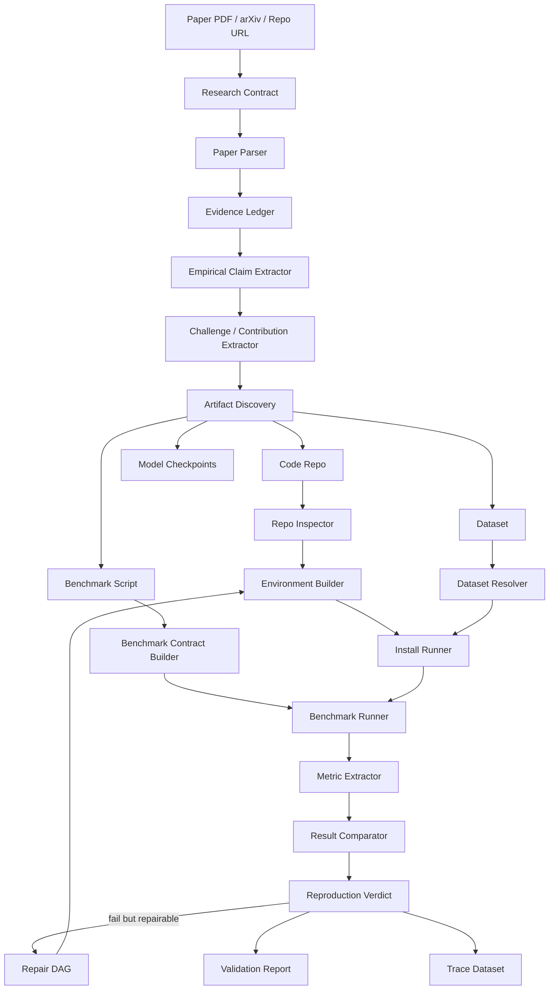

The most useful part of the long chat history is this: your Phase 0 should **not** be a miniature Deep Research report writer. It should be the **Empirical Research Lab** slice of the larger Solar-harness Deep Research architecture.

In the previous design, we talked about:

```text
Research Contract
→ Evidence OS
→ Claim Graph
→ Physical Operators
→ Quality Gate
→ Repair DAG
→ Research Trace Dataset
```

For your Phase 0 “research validator,” these map almost directly to:

```text
Paper PDF
→ Paper Evidence Ledger
→ Empirical Claim Graph
→ Code / Data / Benchmark Execution Operators
→ Reproduction Verdict
→ Failure Repair / Rerun Loop
→ Reproducibility Trace Dataset
```

This is exactly aligned with the direction of recent reproducibility-agent benchmarks. PaperBench evaluates agents on replicating ICML 2024 papers from scratch, including understanding contributions, building code, running experiments, and grading against detailed rubrics; its open implementation separates rollout, reproduction in a fresh GPU container, and grading in another container. ([arXiv][1]) CORE-Bench is even closer to your Phase 0: it focuses on computational reproducibility using provided code and data, across 270 tasks from 90 papers, and evaluates whether agents can reproduce published results. ([arXiv][2])

So the Phase 0 design should be:

> **Given a paper, identify its testable empirical claims, find the associated code/data/benchmark, run the claimed benchmark in a controlled environment, compare reproduced results against the paper’s reported results, and produce a structured reproducibility verdict.**

---

# 1. The most relevant ideas from the old chat

## 1.1 Evidence OS becomes a Paper Evidence Ledger

In the old Deep Research design, we proposed an **Evidence OS**:

```text
source → document → span → evidence → claim
```

For your validator, this becomes:

```text
paper PDF
→ section/table/figure/code-link span
→ evidence record
→ empirical claim
→ benchmark contract
```

The system should not just say:

> “The paper claims method X improves performance.”

It should store exactly where that came from:

```json
{
  "evidence_id": "E-001",
  "paper_id": "P-001",
  "source_type": "paper_pdf",
  "location": {
    "section": "Experiments",
    "page": 7,
    "table": "Table 2",
    "caption": "Main results"
  },
  "text": "Method X achieves 87.4 accuracy on Dataset Y.",
  "evidence_type": "reported_benchmark_result"
}
```

This matters because a research validator cannot validate vague paper summaries. It needs **span-level grounding**.

---

## 1.2 Claim Compiler becomes Empirical Claim Extraction

The earlier chat criticized weak claim mining such as:

```text
split text into sentences → mark all as supports → confidence 0.7
```

For Phase 0, you need a stricter claim compiler that only promotes **testable empirical claims**.

Useful claim types:

```text
benchmark_result_claim
efficiency_claim
ablation_claim
generalization_claim
robustness_claim
scaling_claim
resource_claim
```

Example:

```json
{
  "claim_id": "C-001",
  "claim_type": "benchmark_result_claim",
  "statement": "The proposed method achieves 87.4% accuracy on Dataset Y.",
  "method": "ProposedMethod",
  "task": "image classification",
  "dataset": "Dataset Y",
  "split": "test",
  "metric": "accuracy",
  "reported_value": 87.4,
  "unit": "%",
  "higher_is_better": true,
  "source_evidence": ["E-001"],
  "validation_status": "pending"
}
```

This is one of the most important carryovers from the previous Deep Research design: **the system should validate claims, not papers in general.**

---

## 1.3 Physical operators become executable reproducibility steps

The old architecture emphasized **physical operators** and an **optimizer**. For Phase 0, this is extremely useful.

Your validator should not be one monolithic agent. It should be a DAG of typed operators:

```text
PaperParseOperator
ClaimExtractOperator
CodeLocateOperator
RepoInspectOperator
EnvDetectOperator
InstallOperator
DatasetResolveOperator
BenchmarkContractOperator
CommandInferOperator
RunBenchmarkOperator
MetricParseOperator
ResultCompareOperator
VerdictOperator
FailureClassifyOperator
RepairOperator
```

This is where solar-harness has a natural advantage. A research validator is fundamentally an execution-governance problem.

---

## 1.4 Quality Gate becomes Reproduction Verdict

In the old chat, quality gates were for reports:

```text
citation accuracy
claim support coverage
grounding accuracy
contradiction coverage
```

For Phase 0, the gates become empirical:

```text
code_found
environment_created
dependencies_installed
data_resolved
benchmark_command_found
benchmark_executed
metric_extracted
reported_result_matched
runtime_logged
hardware_logged
patches_audited
```

The verdict should not be binary. The NeurIPS reproducibility community explicitly notes that reproducibility is not simply “reproducible or not”; stronger studies test claims in new settings, limits, and generalization conditions. ([NeurIPS Blog][3])

Use a structured verdict:

```text
PASS
APPROX_PASS
PASS_WITH_MINOR_FIXES
FAIL_REPRODUCTION
FAIL_INSTALL
FAIL_DATA
FAIL_AMBIGUOUS_BENCHMARK
INCONCLUSIVE_RESOURCE_LIMIT
INCONCLUSIVE_MISSING_ARTIFACTS
```

---

## 1.5 Repair DAG becomes bounded troubleshooting

From the old Deep Research design:

```text
gate fail → classify issue → generate repair DAG → rerun affected operators
```

For this project, that becomes:

```text
install failed
→ classify dependency error
→ try allowed patch
→ rerun install
→ log patch
→ rerun benchmark
```

But you need a strict patch policy. Otherwise the validator accidentally becomes a code-modifying optimizer.

Allowed patches:

```text
dependency version pin
missing import installation
path fix
README command normalization
CUDA / CPU fallback flag
deprecated API compatibility wrapper
download path fix
```

Disallowed patches:

```text
algorithm logic changes
model architecture changes
hyperparameter tuning
training longer than paper setting
changing dataset split
editing evaluation metric
changing preprocessing in a way not justified by paper
```

Every patch must be logged:

```json
{
  "patch_id": "PATCH-003",
  "type": "dependency_pin",
  "file": "requirements.txt",
  "change": "numpy<2.0",
  "reason": "package import failure under numpy 2.x",
  "allowed_policy": true,
  "affects_claim_validity": false
}
```

This patch ledger is essential.

---

# 2. Phase 0 product definition

Your Phase 0 should be called something like:

```text
Research Validator v0
```

Its job:

```text
Input:
  - paper PDF or arXiv URL
  - optional GitHub repo URL
  - optional dataset path/API key
  - optional benchmark target claim

Output:
  - extracted claims
  - code/data/benchmark map
  - reproduction environment
  - execution logs
  - reproduced metrics
  - comparison with paper metrics
  - reproducibility verdict
  - validation report
  - trace bundle
```

Not Phase 0:

```text
full deep research report
industry trend analysis
speaker monitoring
multi-paper survey
general autonomous scientific discovery
```

Those are later.

Phase 0 is much narrower:

> **Can this paper’s main empirical claim be reproduced from its code and benchmark?**

---

# 3. Recommended Phase 0 architecture



The key is that **Benchmark Contract Builder** sits between paper claims and code execution.

---

# 4. Core data objects you should implement first

## 4.1 PaperValidationRun

```json
{
  "run_id": "RV-2026-0001",
  "paper_title": "...",
  "paper_url": "...",
  "repo_url": "...",
  "started_at": "2026-05-28T10:00:00Z",
  "validator_version": "0.1.0",
  "hardware_profile": {
    "gpu": "A100-80GB",
    "cuda": "12.1",
    "ram_gb": 128
  },
  "status": "running"
}
```

## 4.2 EmpiricalClaim

```json
{
  "claim_id": "C-001",
  "claim_type": "benchmark_result_claim",
  "method": "ProposedMethod",
  "baseline": "BaselineA",
  "task": "classification",
  "dataset": "DatasetY",
  "split": "test",
  "metric": "accuracy",
  "reported_value": 87.4,
  "reported_uncertainty": null,
  "unit": "%",
  "direction": "higher_is_better",
  "source": {
    "page": 7,
    "table": "Table 2",
    "section": "Experiments"
  },
  "priority": "main_claim"
}
```

## 4.3 ChallengeSolved

This is important because the user specifically mentioned “challenges solved.”

```json
{
  "challenge_id": "CH-001",
  "challenge_statement": "Existing methods fail under distribution shift.",
  "proposed_solution": "The paper introduces contrastive regularization.",
  "claimed_effect": "Improves out-of-domain accuracy.",
  "linked_claims": ["C-003", "C-004"],
  "evidence_spans": ["E-012", "E-018"],
  "validation_strategy": "run original OOD benchmark and new stress benchmark"
}
```

This object lets you connect:

```text
problem claimed by paper
→ method proposed
→ benchmark evidence
→ validation experiment
```

That is better than just extracting scores.

## 4.4 BenchmarkContract

This is probably the most important object in Phase 0.

```yaml
benchmark_id: B-001
claim_id: C-001
task: image_classification
dataset:
  name: DatasetY
  version: unknown
  split: test
  download_source: official
metric:
  name: accuracy
  unit: percent
  higher_is_better: true
reported_result:
  value: 87.4
  tolerance:
    absolute: 0.5
    relative_percent: 1.0
execution:
  command: "python eval.py --config configs/paper_main.yaml"
  working_directory: "repo/"
  expected_outputs:
    - "results/main_eval.json"
environment:
  python: "3.10"
  cuda: "12.1"
  package_manager: "pip"
  install_commands:
    - "pip install -r requirements.txt"
resource_limits:
  max_wall_time_minutes: 180
  max_gpu_hours: 3
  max_disk_gb: 100
```

This prevents the agent from improvising evaluation.

## 4.5 ReproductionResult

```json
{
  "claim_id": "C-001",
  "benchmark_id": "B-001",
  "execution_status": "completed",
  "metric_name": "accuracy",
  "reported_value": 87.4,
  "reproduced_value": 86.9,
  "difference": -0.5,
  "within_tolerance": true,
  "num_runs": 3,
  "mean": 86.95,
  "std": 0.18,
  "verdict": "APPROX_PASS",
  "logs": ["logs/run_001.txt", "logs/run_002.txt"],
  "artifacts": ["results/main_eval.json"]
}
```

---

# 5. Operator design for Phase 0

Your Phase 0 can be implemented as a solar-harness operator DAG.

## 5.1 PaperParseOperator

Inputs:

```text
paper.pdf
```

Outputs:

```text
sections
tables
figures
references
appendix
code links
dataset links
benchmark mentions
```

Extraction targets:

```text
Abstract
Introduction
Contributions
Method
Experiments
Tables
Ablations
Limitations
Appendix
```

## 5.2 ClaimExtractOperator

Goal:

```text
extract only claims that can be tested
```

It should produce claim candidates, then rank them:

```text
main empirical claim
secondary benchmark claim
ablation claim
efficiency claim
qualitative claim
unsupported claim
```

Phase 0 should focus only on:

```text
main empirical claim
main benchmark table
one or two ablation claims
```

Do not try to validate every sentence.

## 5.3 CodeLocateOperator

Sources:

```text
paper PDF links
arXiv metadata
GitHub search
project page
README badges
Papers-with-Code-style metadata
OpenReview supplementary material
```

The output should distinguish:

```text
official_code
author_code
third_party_code
no_code_found
```

Only official or author-linked code should be trusted in Phase 0.

## 5.4 RepoInspectOperator

It should inspect:

```text
README
requirements.txt
pyproject.toml
setup.py
environment.yml
Dockerfile
Makefile
scripts/
configs/
eval.py
train.py
notebooks/
data/
checkpoints/
```

Output:

```json
{
  "package_manager": "pip",
  "has_dockerfile": true,
  "has_eval_script": true,
  "has_training_script": true,
  "has_pretrained_checkpoint": false,
  "likely_entrypoints": [
    "python eval.py --config configs/main.yaml"
  ],
  "risks": [
    "dataset download requires manual agreement",
    "no exact seed specified"
  ]
}
```

## 5.5 EnvBuildOperator

This is where you should borrow from PaperBench and ReproZip.

PaperBench uses separate containers for agent rollout, reproduction, and grading, which is a strong pattern for avoiding contamination between “code creation/fixing” and “final reproduction.” ([GitHub][4]) ReproZip is also useful conceptually because it captures dependencies and supports reproducing experiments through environments such as Docker and Vagrant. ([reprozip.org][5])

For Phase 0, use at least two containers:

```text
analysis_container:
  inspect repo, infer commands, apply allowed patches

reproduction_container:
  fresh environment, run final benchmark from scratch
```

Later add:

```text
grading_container:
  parse outputs, judge rubric, compare metrics
```

## 5.6 BenchmarkContractOperator

This operator turns the paper claim into an executable spec.

It resolves:

```text
dataset
split
metric
preprocessing
checkpoint
evaluation command
random seed
hardware assumptions
tolerance
```

This is where most failures will happen. Many papers are ambiguous.

## 5.7 RunBenchmarkOperator

This should run commands under strict governance:

```text
sandboxed
timeout-limited
GPU-limited
network policy controlled
log everything
capture stdout/stderr
capture output files
capture environment
record git commit
record docker image digest
```

## 5.8 MetricParseOperator

Metric extraction should not rely only on LLM reading logs.

Use a priority order:

```text
1. structured output files: json/csv/yaml
2. known benchmark logs
3. regex parser
4. LLM-assisted parser with validation
5. manual fallback
```

## 5.9 ResultCompareOperator

Compare reported and reproduced results using tolerance policies.

Examples:

```text
exact metric match
within absolute tolerance
within relative tolerance
within reported confidence interval
statistically consistent over N seeds
directionally consistent but lower magnitude
failed
```

## 5.10 VerdictOperator

Produce the final structured verdict.

```json
{
  "paper_id": "P-001",
  "overall_verdict": "PASS_WITH_MINOR_FIXES",
  "main_claim_verdict": "APPROX_PASS",
  "claims_tested": 3,
  "claims_passed": 2,
  "claims_failed": 1,
  "claims_inconclusive": 0,
  "main_failure_modes": [
    "ablation script missing",
    "seed variance higher than paper reports"
  ],
  "trust_score": 0.78
}
```

---

# 6. How to handle “create new benchmarks”

This is the natural extension of the earlier chat’s **Contradiction-first Research** and **Cross-domain Insight / Challenge Benchmark** ideas.

Do not let Phase 0 generate arbitrary new benchmarks. It should generate **challenge benchmarks tied to specific paper claims**.

For each extracted challenge:

```text
paper says it solves X
→ find the benchmark used to prove X
→ reproduce it
→ create stress tests that probe the boundary of X
```

Useful new benchmark types:

```text
seed robustness benchmark
dataset subset benchmark
distribution shift benchmark
input perturbation benchmark
compute budget sensitivity benchmark
ablation consistency benchmark
baseline fairness benchmark
scaling benchmark
latency / memory benchmark
negative control benchmark
```

Example:

```json
{
  "new_benchmark_id": "NB-001",
  "linked_claim": "C-003",
  "benchmark_type": "distribution_shift",
  "purpose": "Test whether the claimed robustness improvement holds under a harder corruption setting.",
  "original_benchmark": "B-002",
  "modification": {
    "dataset_variant": "DatasetY-C",
    "severity": [1, 3, 5]
  },
  "expected_observation": "If the paper's robustness mechanism is real, degradation should be slower than baseline.",
  "validity_risk": "Not used in original paper; should be reported as external validation, not reproduction."
}
```

Important distinction:

```text
original benchmark reproduction
  = did the paper's reported result reproduce?

new challenge benchmark
  = does the claimed mechanism generalize beyond the original test?
```

Your report should keep these separate.

---

# 7. What from the old Deep Research design should be reused directly

## Reuse directly

```text
Evidence Ledger
Claim Graph
Physical Operators
Optimizer
Quality Gate
Repair DAG
Trace Dataset
Source Connector Registry
Rubric Gate
Contradiction-first logic
```

## Adapt

```text
Report Compiler → Validation Report Compiler
Figure Compiler → Benchmark Result Plotter
Research Memory → Reproducibility Memory
Question Graph → Validation Question Graph
```

## Defer

```text
2–5 万字 long reports
industry conference tracking
speaker signal monitoring
macro trend analysis
living industry research
multi-domain technology insight report
```

Those are not Phase 0.

---

# 8. The Phase 0 system should ask these validation questions

From the previous “Question Graph” idea, your validator should build a small validation question graph:

```text
Q1. What is the paper's main empirical claim?
Q2. What benchmark supports that claim?
Q3. What dataset, split, and metric were used?
Q4. Is official code available?
Q5. Is the exact evaluation command available?
Q6. Are model checkpoints required?
Q7. Can the environment be installed?
Q8. Can the benchmark be run?
Q9. Does the reproduced metric match the paper?
Q10. If not, is the failure due to code, data, environment, ambiguity, or claim failure?
Q11. What new benchmark would test the claimed solved challenge?
```

This avoids random agent behavior.

---

# 9. Recommended Phase 0 MVP scope

Keep Phase 0 deliberately narrow.

## Supported papers

```text
ML / AI papers only
paper has public PDF
paper has public code or clear code link
benchmark is computational
dataset is public or user-provided
```

## Supported environments

```text
Python
pip / conda / uv
Dockerfile if available
CUDA optional
single-node execution
```

## Supported validation depth

```text
1 main benchmark claim
1 secondary claim
1 ablation or efficiency claim
```

## Not supported yet

```text
multi-week training
private datasets
human-subject experiments
wet lab experiments
distributed multi-node training
papers with only qualitative results
```

This prevents Phase 0 from becoming impossible.

---

# 10. Suggested Phase 0 verdict schema

```yaml
verdict_levels:
  PASS:
    meaning: "Main result reproduced within tolerance with no material code changes."

  APPROX_PASS:
    meaning: "Main result reproduced close to the paper result, within declared tolerance or expected variance."

  PASS_WITH_MINOR_FIXES:
    meaning: "Result reproduced after non-material environment or path fixes."

  FAIL_REPRODUCTION:
    meaning: "Benchmark ran, but result did not match reported claim."

  FAIL_INSTALL:
    meaning: "Could not create runnable environment."

  FAIL_DATA:
    meaning: "Dataset or checkpoint unavailable or inconsistent."

  FAIL_AMBIGUOUS_BENCHMARK:
    meaning: "Paper/repo did not specify enough details to identify benchmark."

  INCONCLUSIVE_RESOURCE_LIMIT:
    meaning: "Required compute exceeded configured Phase 0 budget."

  INCONCLUSIVE_MISSING_ARTIFACTS:
    meaning: "Missing required code, data, checkpoint, or configuration."
```

This is better than a binary “passes benchmark / fails benchmark.”

---

# 11. Minimum artifact package

Each validation run should produce:

```text
validation_report.md
paper_evidence.jsonl
claims.jsonl
benchmark_contracts.yaml
environment_manifest.json
patch_ledger.jsonl
execution_log.jsonl
metrics.json
verdict.json
reproduction_bundle/
challenge_benchmarks/
```

This is your equivalent of the earlier “Research Artifact Package.”

A good file layout:

```text
runs/RV-2026-0001/
  input/
    paper.pdf
    repo_snapshot.txt
  extracted/
    paper_sections.json
    tables.json
    claims.jsonl
    challenges.jsonl
  benchmark/
    benchmark_contracts.yaml
    new_benchmark_specs.yaml
  env/
    Dockerfile.generated
    environment_manifest.json
    install_log.txt
  execution/
    run_001.log
    run_002.log
    metrics.json
  patches/
    patch_ledger.jsonl
    diff.patch
  verdict/
    verdict.json
    validation_report.md
  trace/
    operator_trace.jsonl
```

---

# 12. How the “optimizer” helps in Phase 0

The optimizer should not be fancy at first. It decides the cheapest valid route to reproduce.

Example choices:

```text
use existing Dockerfile vs infer environment
use pretrained checkpoint vs train from scratch
run full benchmark vs smoke test vs subset test
run CPU fallback vs GPU run
run one seed vs three seeds
```

Optimization objective:

```text
maximize:
  claim validation confidence

minimize:
  compute cost
  wall time
  manual ambiguity
  code modifications
```

Simple policy:

```text
1. Prefer official Dockerfile.
2. Prefer official evaluation script.
3. Prefer official checkpoint.
4. Prefer paper's exact dataset split.
5. Prefer no code patches.
6. If full run exceeds budget, run smoke test but mark as partial.
```

---

# 13. How to use rubrics

PaperBench’s design is especially useful because it decomposes replication into many gradable subtasks and uses paper-specific rubrics. ([arXiv][1])

For your Phase 0, generate a small rubric per paper:

```yaml
rubric:
  - id: R1
    item: "Main empirical claim extracted correctly"
    weight: 10

  - id: R2
    item: "Official code located"
    weight: 10

  - id: R3
    item: "Benchmark dataset and split identified"
    weight: 15

  - id: R4
    item: "Environment built without material code changes"
    weight: 15

  - id: R5
    item: "Original benchmark executed successfully"
    weight: 20

  - id: R6
    item: "Reproduced metric matches reported metric within tolerance"
    weight: 25

  - id: R7
    item: "All patches and deviations are logged"
    weight: 5
```

This gives you a score even when full reproduction fails.

---

# 14. The most important Phase 0 engineering principle

Do **not** let the system silently fix, tune, or reinterpret the paper.

The validator must preserve a strict distinction between:

```text
paper claim
reproduction attempt
environment fix
algorithm modification
new benchmark result
```

That means you need four ledgers:

```text
Evidence Ledger
Patch Ledger
Execution Ledger
Verdict Ledger
```

This is the Phase 0 version of the earlier Evidence OS.

---

# 15. Recommended first implementation sequence

Build it in this order:

```text
1. Paper parser
2. Empirical claim extractor
3. Code/repo locator
4. Repo inspector
5. Benchmark contract builder
6. Environment builder
7. Benchmark runner
8. Metric parser
9. Result comparator
10. Verdict generator
11. Patch ledger
12. Challenge benchmark generator
```

The first useful demo should be:

```text
Input:
  one paper PDF + official GitHub repo

Output:
  main claim extracted
  benchmark command inferred
  repo installed in Docker
  benchmark run
  metric parsed
  reproduced result compared with paper
  verdict generated
```

That is a strong Phase 0.

---

# 16. Final mapping from old chat to your Phase 0

| Old Deep Research idea       | Phase 0 research validator equivalent        |
| ---------------------------- | -------------------------------------------- |
| Research Contract            | Paper validation task spec                   |
| Evidence OS                  | Paper evidence ledger                        |
| Claim Graph                  | Empirical claim graph                        |
| Source Connector Registry    | Paper/repo/dataset/checkpoint locator        |
| Physical Operators           | Parse, install, run, parse metric, compare   |
| Optimizer                    | Choose reproduction route under budget       |
| Quality Gate                 | Reproduction verdict gate                    |
| Repair DAG                   | Dependency/path/API repair loop              |
| Rubric Gate                  | Paper-specific reproducibility rubric        |
| Contradiction-first research | New challenge benchmark generation           |
| Figure Compiler              | Result plots and benchmark comparison charts |
| Research Memory              | Reproducibility memory across papers/repos   |
| Research Trace Dataset       | Training data for future validator agents    |

The old chat gives you the correct architectural pattern. For Phase 0, the key move is to narrow it from “Deep Research report generation” to **claim-grounded computational reproducibility**.

In one sentence:

> **Phase 0 should be a claim-to-benchmark compiler: parse the paper, extract testable claims, compile each claim into a benchmark contract, execute the official code in a controlled environment, compare reproduced metrics against reported metrics, and produce an auditable verdict plus trace bundle.**

[1]: https://arxiv.org/abs/2504.01848 "[2504.01848] PaperBench: Evaluating AI's Ability to Replicate AI Research"
[2]: https://arxiv.org/abs/2409.11363 "[2409.11363] CORE-Bench: Fostering the Credibility of Published Research Through a Computational Reproducibility Agent Benchmark"
[3]: https://blog.neurips.cc/2026/05/04/mlrc-2026-reproducibility-as-an-official-track-at-neurips/ "MLRC 2026: Reproducibility as an Official Track at NeurIPS – NeurIPS Blog"
[4]: https://github.com/openai/preparedness/blob/main/project/paperbench/README.md "frontier-evals/project/paperbench/README.md at main · openai/frontier-evals · GitHub"
[5]: https://www.reprozip.org/about.html "About ReproZip"
